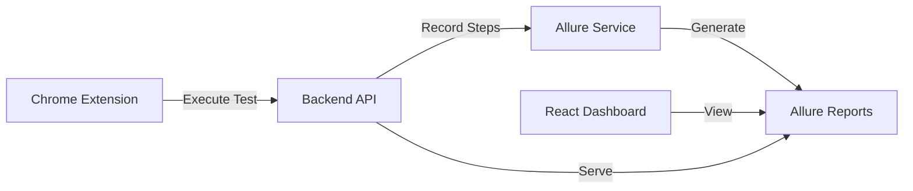
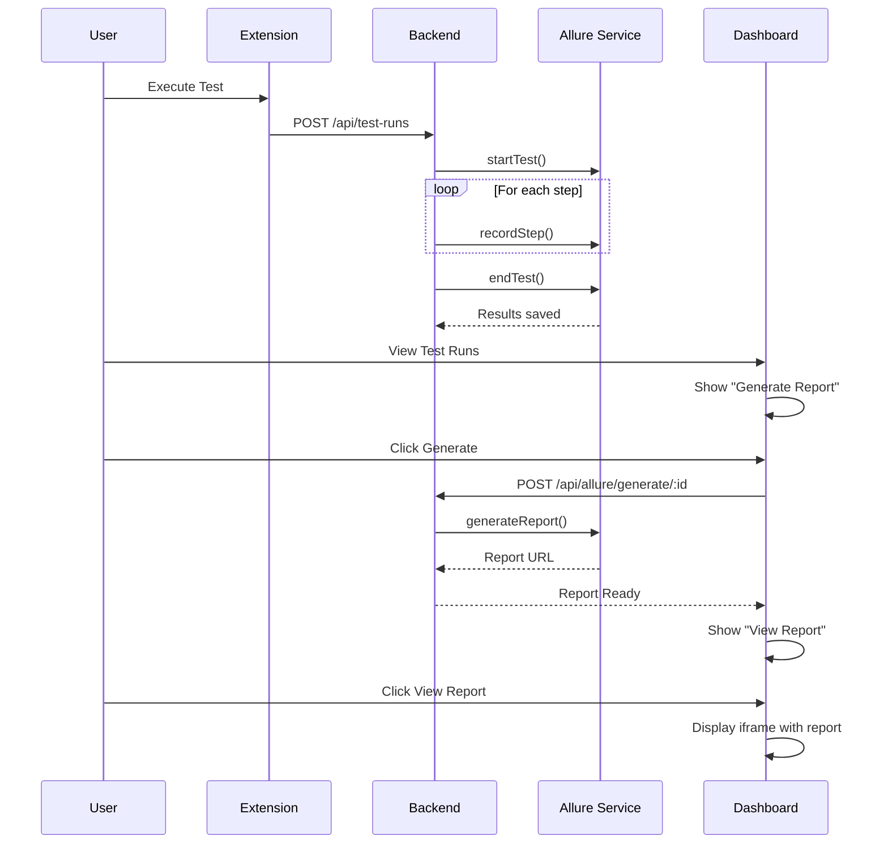

# 📊 ALLURE REPORTING INTEGRATION GUIDE

**Feature**: Automated Allure Report Generation for Playwright Test Execution
**Status**: ✅ Fully Integrated
**Date**: 2025-10-23

---

## 🎯 OVERVIEW

Allure is now fully integrated into the Playwright-CRX dashboard, providing beautiful, interactive HTML reports for all test executions with detailed step-by-step visualization, screenshots, and execution metrics.

### **Key Features**

✅ Automatic report generation after test execution
✅ Interactive HTML reports with charts and graphs
✅ Step-by-step test execution details
✅ Screenshots and attachments support
✅ Historical trend analysis
✅ One-click report viewing in dashboard
✅ Report persistence and management

---

## 🏗️ ARCHITECTURE



### **Components**

1. **Allure Service** (`backend/src/services/allure.service.ts`)
   - Test execution tracking
   - Step recording
   - Report generation
   - Cleanup management

2. **Allure Controller** (`backend/src/controllers/allure.controller.ts`)
   - API endpoints
   - Request handling
   - Error management

3. **Frontend Integration** (`frontend/src/App.tsx`)
   - Allure Reports tab
   - Report viewer (iframe)
   - Generate/View buttons
   - Report management UI

4. **Database Schema**
   - `TestRun.allureReportUrl` field
   - Stores report URL for quick access

---

## 📁 DIRECTORY STRUCTURE

```
playwright-crx-enhanced/backend/
├── allure-results/          # Raw test results (JSON)
│   └── {testRunId}-result.json
├── allure-reports/          # Generated HTML reports
│   └── {testRunId}/
│       ├── index.html       # Main report page
│       ├── data/            # Report data
│       ├── plugins/         # Allure plugins
│       └── styles/          # Report styles
└── src/
    ├── services/
    │   └── allure.service.ts
    ├── controllers/
    │   └── allure.controller.ts
    └── routes/
        └── allure.routes.ts
```

---

## 🔧 API ENDPOINTS

### **Generate Report**
```http
POST /api/allure/generate/:testRunId
Authorization: Bearer {token}
```

**Response**:
```json
{
  "success": true,
  "reportPath": "/path/to/allure-reports/{testRunId}",
  "reportUrl": "/allure-reports/{testRunId}/index.html",
  "message": "Allure report generated successfully"
}
```

### **Get Report URL**
```http
GET /api/allure/report/:testRunId
Authorization: Bearer {token}
```

**Response**:
```json
{
  "success": true,
  "reportUrl": "/allure-reports/{testRunId}/index.html"
}
```

### **Get All Reports**
```http
GET /api/allure/reports
Authorization: Bearer {token}
```

**Response**:
```json
{
  "success": true,
  "reports": [
    {
      "id": "testRunId1",
      "path": "/allure-reports/testRunId1/index.html",
      "createdAt": "2025-10-23T10:30:00Z"
    }
  ]
}
```

### **Cleanup Old Reports**
```http
POST /api/allure/cleanup
Authorization: Bearer {token}
Content-Type: application/json

{
  "days": 7
}
```

---

## 💻 USAGE GUIDE

### **From Dashboard**

1. **Navigate to Test Runs**
   ```
   Dashboard → Test Runs tab
   ```

2. **Generate Report**
   - Click "📊 Generate Report" button next to any test run
   - Wait for generation (usually 2-5 seconds)
   - Button changes to "📊 View Report"

3. **View Report**
   - Click "📊 View Report" button
   - Report opens in Allure Reports tab
   - Interactive HTML report with full details

4. **Allure Reports Tab**
   - Dedicated tab for viewing reports
   - Full-screen iframe viewer
   - Close button to return to test runs

### **From Extension**

1. **Execute Test**
   - Record or select a test script
   - Click "Execute" in Test Executor
   - Test runs and steps are recorded

2. **Auto-Recording**
   - Each step is automatically recorded to Allure
   - Status, duration, and details captured
   - Results stored in `allure-results/`

3. **Generate Report**
   - Go to dashboard after test completion
   - Click "Generate Report"
   - View beautiful HTML report

---

## 📊 REPORT FEATURES

### **Overview Page**
- Test execution summary
- Pass/Fail statistics
- Duration and timeline
- Severity distribution
- Feature breakdown

### **Suites**
- Grouped by test suites
- Hierarchical view
- Expandable test cases

### **Graphs**
- Status chart (pie chart)
- Severity chart
- Duration chart
- Timeline view
- Trend graphs

### **Behaviors**
- Features grouping
- Stories organization
- Epic categorization

### **Packages**
- Package structure
- Class organization
- Method details

### **Test Cases**
- Step-by-step execution
- Screenshots (if available)
- Attachments
- Error messages
- Stack traces
- Timing information

---

## 🔄 INTEGRATION FLOW



---

## 🛠️ CONFIGURATION

### **Environment Variables**

Already configured in `.env`:
```env
# Allure reports directory (auto-created)
ALLURE_REPORTS_DIR=./allure-reports
ALLURE_RESULTS_DIR=./allure-results
```

### **Report Retention**

Default: 7 days

To cleanup old reports:
```bash
POST /api/allure/cleanup
{
  "days": 7
}
```

---

## 🎨 DASHBOARD SCREENSHOTS

### **Test Runs with Allure Buttons**
```
┌─────────────────────────────────────────────┐
│ Sample Login Test                           │
│ ✅ passed  •  2025-10-23 10:30  •  1,234ms │
│                        [📊 View Report]     │
└─────────────────────────────────────────────┘
```

### **Allure Reports Tab**
```
┌──────────────────────────────────────────────┐
│ 📊 Allure Reports Tab                        │
├──────────────────────────────────────────────┤
│                                              │
│  [Interactive Allure HTML Report displayed]  │
│                                              │
│  • Overview graphs                           │
│  • Test case details                         │
│  • Timeline visualization                    │
│  • Screenshot attachments                    │
│                                              │
│                        [Close Report]        │
└──────────────────────────────────────────────┘
```

---

## 🔍 TROUBLESHOOTING

### **Report Not Generating**

**Issue**: "Failed to generate Allure report"

**Solutions**:
1. Ensure Allure CLI is installed:
   ```bash
   npx allure --version
   ```
2. Check `allure-results/` directory exists
3. Verify test run has steps recorded
4. Check backend logs for errors

### **Report Not Displaying**

**Issue**: iframe shows blank page

**Solutions**:
1. Check report URL is correct
2. Verify static files are served: `http://localhost:3000/allure-reports/{id}/index.html`
3. Check browser console for CORS errors
4. Ensure report was generated successfully

### **Old Reports Filling Disk**

**Solution**: Run cleanup API:
```bash
curl -X POST http://localhost:3000/api/allure/cleanup \
  -H "Authorization: Bearer {token}" \
  -H "Content-Type: application/json" \
  -d '{"days": 7}'
```

---

## 📈 BENEFITS

### **For Developers**
- Quick visual feedback on test failures
- Detailed step-by-step execution
- Historical trend analysis
- Easy sharing of test results

### **For QA Teams**
- Professional test reports
- Screenshot evidence
- Failure analysis
- Test coverage metrics

### **For Managers**
- Executive summaries
- Pass/fail statistics
- Quality trends
- Test duration metrics

---

## 🚀 FUTURE ENHANCEMENTS

Planned features:
- [ ] Screenshot auto-capture on failures
- [ ] Video recording integration
- [ ] Custom categories and tags
- [ ] Email report distribution
- [ ] Slack/Teams notifications
- [ ] Historical comparison
- [ ] Parallel execution reports
- [ ] Custom Allure plugins

---

## 📝 TECHNICAL DETAILS

### **Allure JSON Format**

Example `{testRunId}-result.json`:
```json
{
  "uuid": "test-run-id",
  "historyId": "test-run-id",
  "testCaseId": "test-run-id",
  "fullName": "Sample Login Test",
  "name": "Sample Login Test",
  "status": "passed",
  "statusDetails": {},
  "stage": "finished",
  "start": 1698067200000,
  "stop": 1698067201234,
  "steps": [
    {
      "name": "Navigate to login page",
      "status": "passed",
      "stage": "finished",
      "start": 1698067200000,
      "stop": 1698067200500
    },
    {
      "name": "Fill email field",
      "status": "passed",
      "stage": "finished",
      "start": 1698067200500,
      "stop": 1698067200700
    }
  ]
}
```

### **Dependencies**

- `allure-commandline`: CLI tool for report generation
- `allure-js-commons`: JavaScript API for Allure
- React (frontend): Display and interaction
- Express (backend): API and static file serving

---

## ✅ VERIFICATION CHECKLIST

- [x] Allure packages installed
- [x] Database schema updated
- [x] Migration applied
- [x] Allure service created
- [x] API endpoints implemented
- [x] Routes registered
- [x] Static file serving configured
- [x] Frontend tab added
- [x] Generate button implemented
- [x] View button implemented
- [x] iframe viewer working
- [x] Reports persisted to disk
- [x] URL stored in database
- [x] Documentation created

---

## 📞 SUPPORT

**Documentation**: This file
**API Docs**: http://localhost:3000/api-docs
**Allure Docs**: https://docs.qameta.io/allure/

---

**Created**: 2025-10-23
**Version**: 1.0.0
**Status**: ✅ Production Ready
**Integration**: Complete
