# API Recording Fix - Recording from Playwright-Attached Tabs

## Problem Identified

**Issue:** API recording wasn't working when connected to an application because the extension was trying to record from the **active browser tab** instead of the **Playwright-attached tab**.

### Root Cause:
```typescript
// OLD CODE - Wrong approach
const [activeTab] = await chrome.tabs.query({ active: true, currentWindow: true });
recordingTabId = activeTab.id; // ❌ Records from whatever tab is active
```

When you use Playwright recorder:
1. Playwright attaches to a specific tab (your application)
2. The extension knows which tabs are attached (`attachedTabIds`)
3. But API recording ignored this and tried to record from the active tab
4. If you switched tabs, it would record the wrong application!

---

## Solution Implemented

### 1. **Smart Tab Selection**

**File:** `examples/recorder-crx/src/background.ts`

```typescript
// NEW CODE - Correct approach
async function startApiRecording() {
  let targetTabId: number | undefined;
  
  if (attachedTabIds.size > 0) {
    // ✅ Use Playwright-attached tab
    targetTabId = Array.from(attachedTabIds)[0];
    console.log('Using Playwright-attached tab:', targetTabId);
  } else {
    // Fallback: use active tab if no Playwright connection
    const [activeTab] = await chrome.tabs.query({ active: true, currentWindow: true });
    targetTabId = activeTab?.id;
    console.log('Using active tab:', targetTabId);
  }
  
  // Attach debugger to the correct tab
  await chrome.debugger.attach({ tabId: targetTabId }, '1.3');
  await chrome.debugger.sendCommand({ tabId: targetTabId }, 'Network.enable');
}
```

**Benefits:**
- ✅ Records from the tab where Playwright is connected
- ✅ Works even if you switch browser tabs
- ✅ Falls back to active tab if no Playwright connection
- ✅ Clear console logs for debugging

### 2. **Better Error Handling**

**File:** `examples/recorder-crx/src/background.ts`

```typescript
// Propagate errors to UI
if (message.type === 'startApiRecording') {
  startApiRecording()
    .then(() => sendResponse({ success: true }))
    .catch((error) => sendResponse({ success: false, error: error.message }));
  return true; // Keep channel open for async response
}
```

**File:** `examples/recorder-crx/src/apiTestingUI.tsx`

```typescript
// Show helpful error messages
chrome.runtime.sendMessage({ type: 'startApiRecording' }, (response) => {
  if (!response?.success) {
    alert('❌ Failed to start recording: ' + response?.error + 
          '\n\nTips:\n' +
          '- Make sure Playwright is attached to a tab\n' +
          '- Try refreshing the target page\n' +
          '- Check browser console for details');
    setIsRecording(false);
  }
});
```

### 3. **Enhanced UI Feedback**

Added visual indicators:

```tsx
// Empty state when no requests captured
{capturedRequests.length === 0 && (
  <div className="empty-state">
    {isRecording ? (
      <>
        <p>🔍 Listening for API requests...</p>
        <p>Navigate your app to capture network traffic</p>
      </>
    ) : (
      <>
        <p>📡 No requests captured yet</p>
        <p>Click "Start Recording" and browse your app</p>
      </>
    )}
  </div>
)}

// Hint during recording
{isRecording && (
  <span className="recording-hint">
    💡 Browse your app to capture API calls
  </span>
)}
```

---

## How to Test the Fix

### Step 1: Reload Extension
```
1. Open Chrome → chrome://extensions/
2. Find "Playwright CRX"
3. Click "Reload" button
```

### Step 2: Attach Playwright to Your App
```
1. Click Playwright extension icon
2. Login (demo@example.com / demo123)
3. Extension opens recorder
4. Navigate to YOUR APPLICATION (e.g., localhost:3000)
```

### Step 3: Start API Recording
```
1. Click "API" button in toolbar
2. Click "▶️ Start Recording"
3. You should see: ✅ "🔴 Recording... 💡 Browse your app to capture API calls"
```

### Step 4: Interact with Your App
```
1. Keep the recorder open (can be in sidebar or popup)
2. In YOUR APP TAB, interact with the application:
   - Login
   - Submit forms
   - Load data
   - Navigate pages
3. Switch back to extension → see captured API requests!
```

### Step 5: Verify Capture
```
1. Click "⏹️ Stop Recording"
2. Check "Recorder" tab
3. You should see captured requests with:
   ✅ Method (GET/POST/etc.)
   ✅ URL
   ✅ Status code
   ✅ Request/Response bodies
```

---

## Console Logs for Debugging

Now you can check browser console (F12) for helpful logs:

**When recording starts:**
```
✅ API Recording started on tab 123456
Using Playwright-attached tab for API recording: 123456
```

**When requests are captured:**
```
Network.requestWillBeSent: GET https://yourapp.com/api/users
Network.responseReceived: 200 OK
```

**When recording fails:**
```
❌ Failed to start API recording: Cannot access a chrome:// URL
```

---

## Common Issues & Solutions

### Issue 1: "Failed to start recording"

**Symptoms:**
- Alert: "Failed to start recording"
- No requests captured

**Solutions:**
1. ✅ **Make sure Playwright is attached to a tab**
   - Click extension icon on your app's tab
   - Wait for recorder to open

2. ✅ **Refresh your application page**
   - Press F5 to reload
   - Try recording again

3. ✅ **Check if tab is valid**
   - Can't record on `chrome://` pages
   - Must be `http://` or `https://`

### Issue 2: "No requests captured"

**Symptoms:**
- Recording status shows "🔴 Recording..."
- But no requests appear in list

**Possible Causes & Solutions:**

**A. Your app isn't making API calls**
```
✅ Solution: Interact with your app (login, load data, etc.)
```

**B. Requests are being filtered**
```
✅ Solution: Check console - images/fonts are auto-filtered
Only HTTP/HTTPS API calls are captured
```

**C. Recording wrong tab**
```
✅ Solution: 
1. Stop recording
2. Make sure Playwright is attached to your app
3. Start recording again
```

### Issue 3: "Debugger already attached"

**Symptoms:**
- Error: "Another debugger is already attached"

**Solutions:**
1. ✅ **Close Chrome DevTools** on the target tab
2. ✅ **Stop previous recording** before starting new one
3. ✅ **Refresh page** and try again

### Issue 4: Can't see response bodies

**Symptoms:**
- Requests show up
- But response body is empty

**Possible Causes:**
- Response was binary (image, PDF)
- Response too large (>10MB)
- Network error before body received

**Solutions:**
1. ✅ Check response headers - verify Content-Type
2. ✅ Try smaller API responses first
3. ✅ Check browser console for errors

---

## Testing Workflow

### Complete Test Example

```bash
# 1. Start your application
cd playwright-crx-enhanced/backend
npm run dev
# Backend running on http://localhost:3000

cd ../frontend
npm run dev
# Frontend running on http://localhost:5173

# 2. Open Chrome with extension
# Load extension from: examples/recorder-crx/dist

# 3. Test API Recording
a. Navigate to http://localhost:5173
b. Click Playwright extension icon
c. Login with demo@example.com / demo123
d. Click "API" button
e. Click "▶️ Start Recording"
f. In the app: Login, browse pages, etc.
g. Switch to extension → See API calls!
h. Click on any request → See full details
i. Click "+ Test" → Create automated test
j. Switch to "Tests" tab → Run the test
```

---

## What Gets Captured Now

### ✅ Request Details:
```json
{
  "id": "req-123456",
  "method": "POST",
  "url": "http://localhost:3000/api/auth/login",
  "headers": {
    "Content-Type": "application/json",
    "Authorization": "Bearer ..."
  },
  "body": "{\"email\":\"demo@example.com\",\"password\":\"demo123\"}",
  "timestamp": 1234567890
}
```

### ✅ Response Details:
```json
{
  "id": "resp-123456",
  "status": 200,
  "statusText": "OK",
  "headers": {
    "content-type": "application/json"
  },
  "body": "{\"token\":\"...\",\"user\":{...}}",
  "responseTime": 125,
  "timestamp": 1234567891
}
```

---

## Architecture Changes

### Before (Broken):


### After (Fixed):

```mermaid
graph LR
    A[User Clicks Record] --> B{Playwright Attached?}
    B -->|Yes| C[Get Attached Tab ID]
    B -->|No| D[Get Active Tab]
    C --> E[Attach Debugger to Correct Tab]
    D --> E
    E --> F[Record from Correct Tab]
    F --> G[✅ Always records from app]
```


---

## Advanced Usage

### Record Multiple Tabs
Currently records from **first attached tab**. To record from multiple tabs:

```typescript
// Future enhancement:
attachedTabIds.forEach(tabId => {
  chrome.debugger.attach({ tabId }, '1.3');
  // Record from all attached tabs
});
```

### Filter Specific APIs
Customize what gets recorded:

```typescript
// In background.ts - shouldIgnoreRequest()
function shouldIgnoreRequest(url: URL): boolean {
  // Custom filters
  if (url.hostname === 'analytics.google.com') return true;
  if (url.pathname.startsWith('/api/internal')) return true;
  
  return false;
}
```

### Export Captured Data
```typescript
// In apiTestingUI.tsx
const exportRequests = () => {
  const data = JSON.stringify(capturedRequests, null, 2);
  const blob = new Blob([data], { type: 'application/json' });
  const url = URL.createObjectURL(blob);
  const a = document.createElement('a');
  a.href = url;
  a.download = `api-capture-${Date.now()}.json`;
  a.click();
};
```

---

## Verification Checklist

Before reporting issues, verify:

- [ ] Extension reloaded after build
- [ ] Playwright attached to your app tab
- [ ] Your app makes HTTP/HTTPS requests (not chrome://)
- [ ] Chrome DevTools NOT open on target tab
- [ ] Console shows "✅ API Recording started"
- [ ] Actually interacted with app after starting recording
- [ ] Checked console for error messages
- [ ] Tried "+ Demo Data" button (should work instantly)

---

## Files Changed

### 1. `background.ts`
- ✅ Smart tab selection (attached > active)
- ✅ Better error propagation
- ✅ Console logging for debugging

### 2. `apiTestingUI.tsx`
- ✅ Enhanced error messages
- ✅ Empty state indicators
- ✅ Recording hints
- ✅ Better user guidance

---

## Next Steps

1. **Test with your application**
   - Start backend/frontend
   - Attach Playwright
   - Record API calls
   - Verify capture works

2. **Check console logs**
   - Open DevTools (F12)
   - Look for green checkmarks ✅
   - Report any red X errors ❌

3. **Create tests**
   - Click "+ Test" on captured requests
   - Add custom assertions
   - Run and validate

4. **Report issues**
   - Include console logs
   - Screenshot of error
   - Steps to reproduce

---

## Status

✅ **Build Successful**  
✅ **Tab Selection Fixed**  
✅ **Error Handling Improved**  
✅ **UI Feedback Enhanced**  
🧪 **Ready for Testing**

---

**Test Now:** Reload extension and try recording from your Playwright-attached application!
