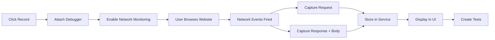

# API Recording in Extension - Complete Guide

## Quick Start (3 Steps)

### Step 1: Reload Extension
1. Open Chrome → `chrome://extensions/`
2. Find "Playwright CRX"
3. Click **"Reload"** button

### Step 2: Start Recording
1. Click the Playwright extension icon
2. Login (use demo credentials if needed)
3. Click **"API"** button in toolbar
4. Click **"▶️ Start Recording"**

> ⚠️ You'll see a yellow banner: "Chrome is being controlled by automated test software" - this is normal!

### Step 3: Capture API Calls
1. Open a new tab
2. Visit any website with APIs (examples below)
3. Interact with the site
4. Return to extension → Click **"⏹️ Stop Recording"**
5. View captured requests in Recorder tab!

---

## Test Websites (With APIs)

### Option 1: JSONPlaceholder (Best for Testing)
```
https://jsonplaceholder.typicode.com/
```
**What to do:**
- Click "Run" buttons on homepage
- Creates GET/POST requests you can capture

### Option 2: GitHub
```
https://github.com
```
**What to do:**
- Login/browse repositories
- Captures authentication and REST API calls

### Option 3: Any Modern Website
- Twitter/X
- Reddit
- Stack Overflow
- Gmail

Most modern sites make API calls when you:
- Login
- Search
- Load content
- Submit forms

---

## What You'll See

### In "Recorder" Tab:
```
┌─────────────────────────────────────────────┐
│ 📡 Recorder                                 │
├─────────────────────────────────────────────┤
│ [▶️ Start Recording]  ⚫ Not Recording      │
├─────────────────────────────────────────────┤
│ Captured Requests (5)                       │
│                                             │
│ GET  https://api.github.com/user      200  │
│ POST https://api.github.com/graphql   200  │
│ GET  https://avatars.githubusercontent...   │
└─────────────────────────────────────────────┘
```

### Click any request to see:
```json
Request:
  URL: https://api.github.com/user
  Method: GET
  Headers: {
    "Authorization": "Bearer token...",
    "Content-Type": "application/json"
  }

Response:
  Status: 200 OK
  Time: 125ms
  Body: {
    "login": "username",
    "id": 12345,
    "name": "User Name"
  }
```

---

## Features Available

### 1. **Create Tests from Captured Requests**
- Click **"+ Test"** button on any request
- Automatically generates assertions:
  - Status code validation
  - Response time check
  - Body validation

### 2. **Execute Tests**
- Switch to "Tests" tab
- Click **"▶️ Run"** on any test
- See pass/fail results instantly

### 3. **Generate Code**
Available in `apiTestingService.generateCode()`:
- ✅ Playwright (JavaScript/TypeScript)
- ✅ Python (pytest)
- ✅ Java (JUnit)

### 4. **Demo Mode** (No Recording Needed)
Click **"+ Demo Data"** button to add sample API request for testing the UI

---

## Under the Hood

### How It Works



### Technical Stack

**Chrome APIs Used:**
```javascript
chrome.debugger.attach({ tabId }, '1.3')
chrome.debugger.sendCommand({ tabId }, 'Network.enable')
chrome.debugger.onEvent.addListener()
```

**Network Protocol:**
- Uses Chrome DevTools Protocol (CDP)
- Same API Chrome DevTools uses internally
- Full access to Network domain events

**Storage:**
- In-memory during recording
- Chrome local storage for persistence
- Can export to database via "Save DB"

---

## Advanced Usage

### Filter Specific APIs Only

Currently auto-filters:
```javascript
// Ignored URLs:
- chrome-extension://...
- *.png, *.jpg, *.svg (static assets)
- chrome.google.com (internal)
```

### Performance Benchmarking
1. Create benchmark in "Benchmark" tab
2. Set target response time (e.g., 500ms)
3. Run multiple iterations
4. Get P50, P95, P99 metrics

### API Mocking
1. Switch to "Mocks" tab
2. Create mock for URL pattern
3. Define custom response
4. Toggle on/off as needed

---

## Troubleshooting

### "Failed to start recording"
**Solution:** Make sure you're on an actual website, not:
- `chrome://` pages
- `about:blank`
- Extension pages

### No Requests Captured
**Possible causes:**
1. Website doesn't make API calls
2. All requests are static resources (filtered out)
3. Recording stopped too early

**Try:**
- Use JSONPlaceholder test site
- Wait longer before stopping
- Click "+ Demo Data" to verify UI works

### Debugger Warning Banner
**Message:** "Chrome is being controlled by automated test software"

**This is normal!** The extension uses Chrome's debugger API. The banner appears when debugger is attached and disappears when you stop recording.

---

## Permissions Required

Already configured in extension:
```json
{
  "permissions": [
    "debugger",  ← Required for network capture
    "tabs",      ← Required to attach to tabs
    "storage"    ← Required to save data
  ]
}
```

---

## Comparison with Other Tools

| Feature | This Extension | Postman | Insomnia | Chrome DevTools |
|---------|----------------|---------|----------|-----------------|
| Auto-capture from browser | ✅ Yes | ❌ No | ❌ No | ⚠️ Manual |
| Full request/response | ✅ Yes | ✅ Yes | ✅ Yes | ✅ Yes |
| Create tests from capture | ✅ Yes | ⚠️ Limited | ⚠️ Limited | ❌ No |
| Generate test code | ✅ Yes | ⚠️ Limited | ❌ No | ❌ No |
| API mocking | ✅ Yes | ⚠️ Separate tool | ❌ No | ⚠️ Override |
| Integrated with Playwright | ✅ Yes | ❌ No | ❌ No | ❌ No |

---

## Next Steps

### Immediate:
1. ✅ Test recording on JSONPlaceholder
2. ✅ Create a test case
3. ✅ Run the test
4. ✅ Check "Tests" tab for results

### Advanced:
1. 📊 Create performance benchmarks
2. 🎭 Set up API mocks
3. 💾 Save tests to database
4. 📝 Generate Playwright test code
5. 🔄 Integrate with CI/CD

---

## Example Workflow

### Scenario: Test User Login API

1. **Record:**
   ```
   - Click "API" → "Start Recording"
   - Go to your login page
   - Submit login form
   - Stop recording
   ```

2. **Find Request:**
   ```
   POST /api/auth/login
   Status: 200
   Response: { "token": "...", "user": {...} }
   ```

3. **Create Test:**
   ```
   - Click "+ Test" on the request
   - Name: "User Login Success"
   - Auto-generates assertions:
     ✓ Status equals 200
     ✓ Response time < 2000ms
   ```

4. **Add Custom Assertions:**
   ```javascript
   // In future: Can add via UI
   - Body contains "token"
   - Response JSON schema validation
   ```

5. **Generate Code:**
   ```typescript
   // Exported Playwright test:
   test('User Login Success', async ({ request }) => {
     const response = await request.post('/api/auth/login', {
       data: { email: '...', password: '...' }
     });
     expect(response.status()).toBe(200);
   });
   ```

---

## FAQ

**Q: Can I record APIs from any website?**
A: Yes! As long as the site makes HTTP/HTTPS requests and isn't a chrome:// page.

**Q: Does it capture request bodies?**
A: Yes, including POST/PUT JSON payloads.

**Q: Can I export recorded requests?**
A: Yes, click "Save DB" to save to database, or generate test code.

**Q: Is there a limit to captured requests?**
A: Only browser memory. Clear with "Start Recording" (resets).

**Q: Can I edit requests before creating tests?**
A: Not directly in UI yet, but you can modify generated test code.

**Q: Does it work with GraphQL?**
A: Yes! GraphQL is just POST requests to /graphql endpoint.

**Q: Can I record WebSocket traffic?**
A: Not currently - only HTTP/HTTPS. WebSocket requires different API.

---

**Status:** ✅ **Fully Functional & Ready to Use**

Start recording APIs now - no additional setup needed!
