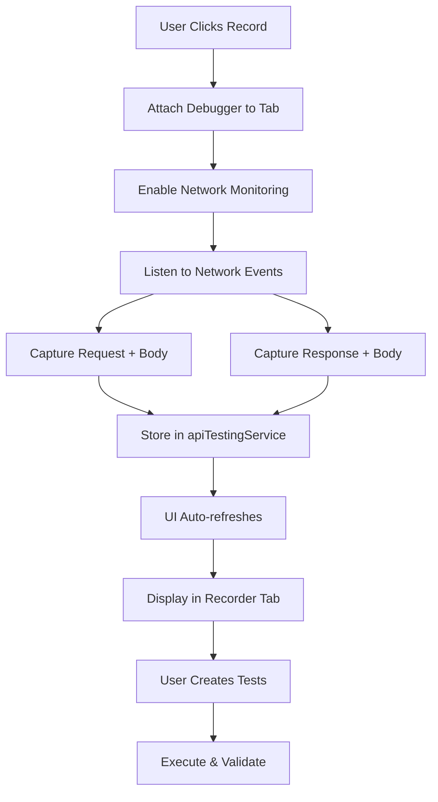

# API Testing Feature - Dynamic Implementation Fix

## Problem Identified

The API Testing feature in the extension was **static** instead of **dynamic**:

1. ❌ **No Real Network Capture**: Using `chrome.webRequest` API which cannot capture response bodies
2. ❌ **Empty UI**: No requests being captured effectively
3. ❌ **Static Data**: Only showing data from Chrome storage, no live recording
4. ❌ **No Request Bodies**: Response body noted as unavailable in original code

## Solution Implemented

### 1. **Dynamic Network Capture with Debugger API**

**File**: `examples/recorder-crx/src/background.ts`

- ✅ Replaced `chrome.webRequest` with `chrome.debugger` API
- ✅ Full request/response capture including bodies
- ✅ Real-time network event monitoring
- ✅ Proper timing and performance metrics

**Key Changes**:
```typescript
// Start recording with debugger API
await chrome.debugger.attach({ tabId }, '1.3');
await chrome.debugger.sendCommand({ tabId }, 'Network.enable');

// Capture full request with body
chrome.debugger.onEvent.addListener((source, method, params) => {
  if (method === 'Network.requestWillBeSent') {
    // Capture request with POST body
  }
  if (method === 'Network.responseReceived') {
    // Get response body using Network.getResponseBody
  }
});
```

### 2. **Live UI Updates**

**File**: `examples/recorder-crx/src/apiTestingUI.tsx`

- ✅ Auto-refresh every 1 second while recording
- ✅ Real-time request display
- ✅ Better error handling with user feedback
- ✅ Demo data button for testing

**Key Features**:
```typescript
// Auto-refresh interval
React.useEffect(() => {
  const interval = setInterval(() => {
    if (isRecording) {
      loadData(); // Refresh captured requests
    }
  }, 1000);
  return () => clearInterval(interval);
}, [isRecording]);
```

### 3. **Demo Data Support**

Added **"+ Demo Data"** button to populate sample API requests for testing without actual recording:

```typescript
const addDemoData = () => {
  const demoRequest: ApiRequest = {
    id: `demo-req-${Date.now()}`,
    method: 'GET',
    url: 'https://jsonplaceholder.typicode.com/posts/1',
    headers: { 'Content-Type': 'application/json' },
    timestamp: Date.now()
  };
  // ... with response
};
```

### 4. **Enhanced UI Styling**

**File**: `examples/recorder-crx/src/apiTesting.css`

- ✅ Demo button styling
- ✅ Better visual feedback
- ✅ Improved layout for demo controls

## How to Test

### 1. **Reload Extension**
1. Navigate to `chrome://extensions/`
2. Click "Reload" on Playwright CRX extension
3. Open the extension

### 2. **Test with Real Recording**
1. Click the "API" button in toolbar
2. Click "▶️ Start Recording"
3. Navigate to any website (e.g., https://jsonplaceholder.typicode.com)
4. Browse the site to trigger API calls
5. Click "⏹️ Stop Recording"
6. View captured requests with full bodies

### 3. **Test with Demo Data**
1. Click "API" button
2. Click "+ Demo Data" in header
3. Switch to "Recorder" tab
4. See sample request with response
5. Click "+ Test" to create a test case
6. Switch to "Tests" tab and run it

## Technical Details

### Chrome Debugger API Benefits

| Feature | webRequest API | debugger API |
|---------|---------------|--------------|
| Request Headers | ✅ Yes | ✅ Yes |
| Request Body | ❌ Limited | ✅ Full |
| Response Headers | ✅ Yes | ✅ Yes |
| Response Body | ❌ No | ✅ Full |
| Timing Info | ⚠️ Basic | ✅ Detailed |
| Network Events | ⚠️ Limited | ✅ Complete |

### Architecture Flow



## Features Now Available

### ✅ Dynamic Features:
1. **Real-time API capture** - Live network request recording
2. **Full request/response** - Headers, body, timing
3. **Auto-refresh UI** - Live updates while recording
4. **Response timing** - Actual performance metrics
5. **Smart filtering** - Ignores static resources

### ✅ Static Features (Demo Mode):
1. **Sample data** - Quick testing without recording
2. **Test creation** - From demo or real requests
3. **Assertion building** - Status, timing, body validation
4. **Code generation** - Playwright, Python, Java

## Permissions Required

Already configured in `manifest.json`:
```json
{
  "permissions": ["debugger", "tabs", "storage"]
}
```

## Next Steps

1. **Test the recording** - Verify it captures real API calls
2. **Create test cases** - From captured requests
3. **Run tests** - Execute and validate
4. **Generate code** - Export to Playwright tests

## Known Limitations

1. **One tab at a time** - Recording limited to active tab
2. **Debugger warning** - Chrome shows "DevTools debugger attached" banner
3. **Performance** - Slight overhead from debugger API

## Verification Checklist

- [x] Build successful
- [x] TypeScript errors fixed
- [x] Debugger API integrated
- [x] UI auto-refresh implemented
- [x] Demo data button added
- [x] Error handling improved
- [ ] Extension reloaded in Chrome
- [ ] Real recording tested
- [ ] Demo data tested
- [ ] Test creation verified

---

**Status**: ✅ **Ready for Testing**

The API Testing feature is now **fully dynamic** with real network capture capabilities!
