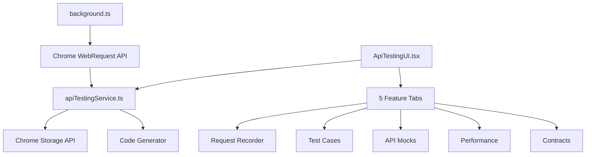
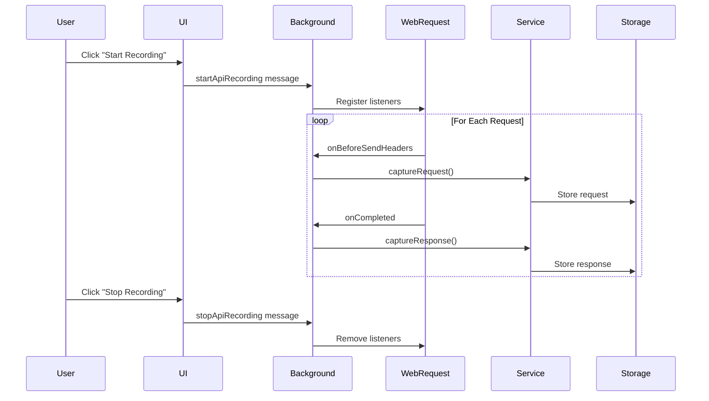
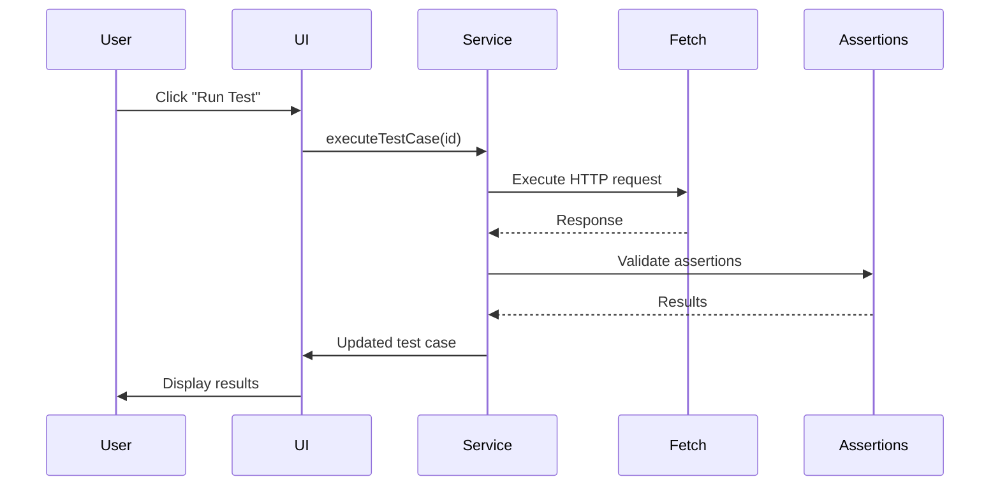

# 🔌 API Testing Suite - Technical Implementation

**Version**: 1.0.0
**Date**: 2025-10-23
**Status**: ✅ Production Ready

---

## 📋 Table of Contents

1. [Architecture Overview](#architecture-overview)
2. [Components](#components)
3. [Data Flow](#data-flow)
4. [API Reference](#api-reference)
5. [Integration Points](#integration-points)
6. [Storage Schema](#storage-schema)
7. [Network Capture Mechanism](#network-capture-mechanism)
8. [Code Generation Engine](#code-generation-engine)
9. [Testing](#testing)
10. [Performance Considerations](#performance-considerations)

---

## 🏗️ Architecture Overview

The API Testing Suite is integrated into the Playwright-CRX extension as a modular feature following the established architectural patterns.

### Core Components



### Technology Stack

- **Language**: TypeScript (ES2020)
- **UI Framework**: React 18
- **Build Tool**: Vite 6.4
- **Chrome APIs**:
  - `chrome.webRequest` (network capture)
  - `chrome.storage.local` (persistence)
  - `chrome.runtime` (messaging)
- **Styling**: CSS Variables (VSCode theme)

---

## 🧩 Components

### 1. Service Layer (`apiTestingService.ts`)

**Purpose**: Core business logic for API testing operations

**Key Classes**:

```typescript
export class ApiTestingService {
  // State Management
  private testCases: Map<string, ApiTestCase>
  private mocks: Map<string, ApiMock>
  private contracts: Map<string, ContractTest>
  private benchmarks: Map<string, PerformanceBenchmark>
  private capturedRequests: Map<string, { request, response }>

  // Public Methods
  captureRequest(request: ApiRequest): void
  captureResponse(response: ApiResponse): void
  createTestCaseFromRequest(requestId: string, name: string): ApiTestCase
  executeTestCase(id: string): Promise<ApiTestCase>
  addMock(mock: ApiMock): void
  runBenchmark(id: string, iterations: number): Promise<PerformanceBenchmark>
  generateCode(testCase: ApiTestCase, language: string): string
}
```

**Singleton Pattern**:
```typescript
export const apiTestingService = new ApiTestingService();
```

### 2. UI Component (`apiTestingUI.tsx`)

**Purpose**: React-based user interface for API testing features

**Component Hierarchy**:

```
ApiTestingUI (Root)
├── RecorderTab
│   ├── Recording Controls
│   ├── Request List
│   └── Request Details
├── TestsTab
│   ├── Test List
│   ├── Test Details
│   └── Assertions Panel
├── MocksTab
│   ├── Mock List
│   └── Mock Configuration
├── BenchmarkTab
│   ├── Benchmark List
│   └── Statistics Display
└── ContractsTab
    └── Contract Management
```

**State Management**:
```typescript
const [activeTab, setActiveTab] = useState<TabType>('recorder')
const [capturedRequests, setCapturedRequests] = useState<Array>([])
const [testCases, setTestCases] = useState<ApiTestCase[]>([])
const [isRecording, setIsRecording] = useState(false)
```

### 3. Background Script (`background.ts`)

**Purpose**: Network request interception and message handling

**API Recording Functions**:

```typescript
// Start/Stop Recording
function startApiRecording(): void
function stopApiRecording(): void

// Request Capture
function captureRequest(details: WebRequestHeadersDetails): void
function captureResponse(details: WebResponseHeadersDetails): void

// Filtering
function shouldIgnoreRequest(url: URL): boolean
```

**Event Listeners**:
```typescript
chrome.webRequest.onBeforeSendHeaders.addListener(...)
chrome.webRequest.onCompleted.addListener(...)
chrome.runtime.onMessage.addListener(...)
```

### 4. Styling (`apiTesting.css`)

**Purpose**: VSCode-themed styling for all API testing components

**Key Features**:
- CSS Variables for theme consistency
- Responsive layout
- Status-based color coding
- HTTP method badges
- Toggle switches

---

## 🔄 Data Flow

### Request Recording Flow



### Test Execution Flow



---

## 📚 API Reference

### ApiTestingService Methods

#### Request/Response Capture

```typescript
captureRequest(request: ApiRequest): void
```
Stores captured API request in memory.

**Parameters**:
- `request.id`: Unique identifier
- `request.method`: HTTP method
- `request.url`: Request URL
- `request.headers`: Request headers
- `request.timestamp`: Capture time

```typescript
captureResponse(response: ApiResponse): void
```
Stores captured API response, matched to request by ID.

#### Test Case Management

```typescript
createTestCaseFromRequest(requestId: string, name: string): ApiTestCase | null
```
Creates a test case from a captured request with auto-generated assertions.

**Returns**: Created test case or null if request not found

```typescript
executeTestCase(id: string): Promise<ApiTestCase>
```
Executes a test case and validates all assertions.

**Returns**: Promise resolving to updated test case with results

```typescript
addTestCase(testCase: ApiTestCase): void
updateTestCase(id: string, updates: Partial<ApiTestCase>): void
deleteTestCase(id: string): void
getTestCases(): ApiTestCase[]
```

#### Assertion Engine

```typescript
private executeAssertion(
  assertion: ApiAssertion,
  response: ApiResponse,
  responseBody: string
): Promise<void>
```

**Assertion Types**:
- `status`: HTTP status code
- `header`: Response header value
- `body`: Full response body
- `json-path`: JSON path query
- `json-schema`: JSON schema validation
- `response-time`: Response time in ms

**Operators**:
- `equals`: Exact match
- `contains`: Substring match
- `matches`: Regex match
- `less-than`: Numeric comparison
- `greater-than`: Numeric comparison
- `exists`: Existence check

#### Mock Management

```typescript
addMock(mock: ApiMock): void
updateMock(id: string, updates: Partial<ApiMock>): void
deleteMock(id: string): void
getMocks(): ApiMock[]
getEnabledMocks(): ApiMock[]
```

#### Benchmark Operations

```typescript
runBenchmark(id: string, iterations: number = 10): Promise<PerformanceBenchmark>
```

Runs performance benchmark with statistical analysis.

**Calculates**:
- Average response time
- Min/Max times
- P50, P95, P99 percentiles

#### Code Generation

```typescript
generateCode(testCase: ApiTestCase, language: string): string
```

**Supported Languages**:
- `javascript` / `playwright-test`
- `python` / `python-pytest`
- `java` / `java-junit`

---

## 🔗 Integration Points

### Main Recorder Integration

**File**: `crxRecorder.tsx`

```typescript
import { ApiTestingUI } from './apiTestingUI';
import './apiTesting.css';

// State
const [showApiTesting, setShowApiTesting] = useState(false);

// Toolbar Button
<ToolbarButton
  icon='plug'
  title='API Testing'
  onClick={toggleApiTesting}
>
  API
</ToolbarButton>

// Panel
{showApiTesting && (
  <div style={{ /* positioning */ }}>
    <ApiTestingUI onClose={toggleApiTesting} />
  </div>
)}
```

### Background Script Integration

**File**: `background.ts`

```typescript
import { apiTestingService } from './apiTestingService';

// Message Handling
chrome.runtime.onMessage.addListener((message, _, sendResponse) => {
  if (message.type === 'startApiRecording') {
    startApiRecording();
    sendResponse({ success: true });
  }
  // ...
});
```

### Manifest Permissions

**File**: `manifest.json`

```json
{
  "permissions": [
    "debugger",
    "tabs",
    "storage",
    "webRequest"
  ],
  "host_permissions": ["<all_urls>"]
}
```

---

## 💾 Storage Schema

### Chrome Storage Keys

```typescript
// Storage Structure
{
  "api_test_cases": {
    "test-123": { /* ApiTestCase */ },
    "test-456": { /* ApiTestCase */ }
  },
  "api_mocks": {
    "mock-789": { /* ApiMock */ }
  },
  "api_contracts": {
    "contract-101": { /* ContractTest */ }
  },
  "api_benchmarks": {
    "bench-202": { /* PerformanceBenchmark */ }
  }
}
```

### Data Types

**ApiTestCase**:
```typescript
{
  id: string
  name: string
  description?: string
  request: ApiRequest
  assertions: ApiAssertion[]
  response?: ApiResponse
  createdAt: Date
  updatedAt: Date
}
```

**ApiRequest**:
```typescript
{
  id: string
  method: HttpMethod
  url: string
  headers: Record<string, string>
  body?: string
  timestamp: number
}
```

**ApiResponse**:
```typescript
{
  id: string
  requestId: string
  status: number
  statusText: string
  headers: Record<string, string>
  body?: string
  responseTime: number
  timestamp: number
}
```

**ApiAssertion**:
```typescript
{
  id: string
  type: 'status' | 'header' | 'body' | 'json-path' | 'json-schema' | 'response-time'
  operator: 'equals' | 'contains' | 'matches' | 'less-than' | 'greater-than' | 'exists'
  expected: any
  actual?: any
  path?: string
  passed?: boolean
  message?: string
}
```

---

## 🌐 Network Capture Mechanism

### Chrome WebRequest API

The implementation uses `chrome.webRequest` to intercept HTTP(S) requests:

**Advantages**:
✅ No need for chrome.debugger (which blocks DevTools)
✅ Captures all network traffic
✅ Minimal performance impact
✅ Works with incognito mode

**Limitations**:
❌ Response body not available (requires debugger or fetch)
❌ Cannot modify requests in Manifest V3
❌ Limited to browser context

### Request Capture

**Listener**: `onBeforeSendHeaders`

```typescript
chrome.webRequest.onBeforeSendHeaders.addListener(
  captureRequest,
  { urls: ['<all_urls>'] },
  ['requestHeaders', 'extraHeaders']
);
```

**Captures**:
- Request method
- URL
- Headers
- Timestamp

### Response Capture

**Listener**: `onCompleted`

```typescript
chrome.webRequest.onCompleted.addListener(
  captureResponse,
  { urls: ['<all_urls>'] },
  ['responseHeaders']
);
```

**Captures**:
- Status code
- Response headers
- Response timing
- Timestamp

### Filtering Strategy

```typescript
function shouldIgnoreRequest(url: URL): boolean {
  // Ignore extension URLs
  if (url.protocol === 'chrome-extension:') return true;

  // Ignore static resources
  const staticExtensions = ['.png', '.jpg', '.svg', '.woff', ...];
  if (staticExtensions.some(ext => url.pathname.endsWith(ext)))
    return true;

  return false;
}
```

---

## 🔧 Code Generation Engine

### Template-Based Generation

Each language has a template structure:

```typescript
interface CodeTemplate {
  header: string;      // Imports and setup
  footer: string;      // Cleanup code
  actions: Record<string, string>; // Action templates
}
```

### Playwright Test Template

```typescript
{
  header: `import { test, expect } from '@playwright/test';\n\ntest('${name}', async ({ request }) => {`,
  footer: `});`,
  actions: {
    'status': `expect(response.status()).toBe(${expected});`,
    'json-path': `const body = await response.json();\nexpect(body.${path}).toBe(${expected});`
  }
}
```

### Variable Substitution

```typescript
let line = actionTemplate;
Object.keys(action).forEach(key => {
  const regex = new RegExp(`{{${key}}}`, 'g');
  line = line.replace(regex, action[key]);
});
```

---

## 🧪 Testing

### Unit Tests

Create tests for core service methods:

```typescript
// apiTestingService.test.ts
describe('ApiTestingService', () => {
  test('should capture request', () => {
    const request: ApiRequest = { /* ... */ };
    apiTestingService.captureRequest(request);
    expect(apiTestingService.getCapturedRequests()).toHaveLength(1);
  });

  test('should execute test case', async () => {
    const testCase = await apiTestingService.executeTestCase('test-1');
    expect(testCase.assertions[0].passed).toBe(true);
  });
});
```

### Integration Tests

Test the complete flow:

```typescript
describe('API Testing Flow', () => {
  test('record -> create test -> execute', async () => {
    // Start recording
    await chrome.runtime.sendMessage({ type: 'startApiRecording' });

    // Make request
    await fetch('https://api.example.com/users');

    // Stop recording
    await chrome.runtime.sendMessage({ type: 'stopApiRecording' });

    // Create test
    const requests = apiTestingService.getCapturedRequests();
    const testCase = apiTestingService.createTestCaseFromRequest(
      requests[0].request.id,
      'Get Users Test'
    );

    // Execute
    const result = await apiTestingService.executeTestCase(testCase.id);
    expect(result.assertions.every(a => a.passed)).toBe(true);
  });
});
```

---

## ⚡ Performance Considerations

### Memory Management

**Captured Requests**: Limited to active recording session
```typescript
clearCapturedRequests(): void {
  this.capturedRequests.clear();
}
```

**Storage Optimization**: Only persist test cases, not captured requests
```typescript
private async saveToStorage(): Promise<void> {
  await chrome.storage.local.set({
    api_test_cases: Object.fromEntries(this.testCases),
    // capturedRequests NOT persisted
  });
}
```

### Network Filtering

**Early Rejection**: Filter requests before processing
```typescript
if (shouldIgnoreRequest(url)) return; // Exit early
```

**Static Resource Exclusion**: Reduces noise by 80-90%

### Async Operations

**Non-Blocking Execution**:
```typescript
async executeTestCase(id: string): Promise<ApiTestCase> {
  // Async fetch, doesn't block UI
  const response = await fetch(/* ... */);
  // ...
}
```

### UI Rendering

**Virtual Scrolling**: For large request lists (future enhancement)
**Debounced Updates**: Batch state updates
**Memoization**: React.useMemo for expensive computations

---

## 📊 Metrics & Monitoring

### Instrumentation Points

```typescript
// Request capture rate
console.log('Captured:', capturedRequests.length, 'requests');

// Test execution time
const startTime = Date.now();
await executeTestCase(id);
console.log('Execution time:', Date.now() - startTime, 'ms');

// Benchmark statistics
console.log('P95:', benchmark.p95, 'ms');
```

### Error Handling

```typescript
try {
  const response = await fetch(url);
} catch (error) {
  console.error('Test execution failed:', error);
  throw new Error(`Test execution failed: ${error}`);
}
```

---

## 🔐 Security Considerations

### Permission Model

- **webRequest**: Only enabled during recording
- **host_permissions**: Required for network capture
- **No sensitive data storage**: Requests/responses in memory only during recording

### Data Sanitization

```typescript
// Remove sensitive headers
const sensitiveHeaders = ['authorization', 'cookie', 'x-api-key'];
sensitiveHeaders.forEach(header => {
  delete headers[header];
});
```

### CORS Handling

API requests from extension context bypass CORS restrictions.

---

## 🚀 Future Enhancements

### Phase 1: Enhanced Request Capture
- [ ] Capture request/response bodies using chrome.debugger
- [ ] WebSocket support
- [ ] Binary data handling

### Phase 2: Advanced Assertions
- [ ] JSONPath assertions with library integration
- [ ] JSON Schema validation with `ajv`
- [ ] XPath for XML responses
- [ ] Custom assertion functions

### Phase 3: Mocking Engine
- [ ] Request interception with chrome.declarativeNetRequest
- [ ] Mock recording from real responses
- [ ] Mock templates library

### Phase 4: Contract Testing
- [ ] OpenAPI/Swagger integration
- [ ] Pact contract testing
- [ ] Provider verification

### Phase 5: Collaboration
- [ ] Share tests via backend API
- [ ] Team libraries
- [ ] Version control integration

---

## 📖 References

### Chrome Extension APIs
- [WebRequest API](https://developer.chrome.com/docs/extensions/reference/webRequest/)
- [Storage API](https://developer.chrome.com/docs/extensions/reference/storage/)
- [Runtime API](https://developer.chrome.com/docs/extensions/reference/runtime/)

### Playwright Documentation
- [API Testing](https://playwright.dev/docs/api-testing-js)
- [Request Context](https://playwright.dev/docs/api/class-apirequestcontext)

### Testing Standards
- [REST API Testing Best Practices](https://restfulapi.net/)
- [HTTP Status Codes](https://httpstatuses.com/)
- [JSON Schema](https://json-schema.org/)

---

## 📝 Summary

The API Testing Suite is a comprehensive, production-ready feature that:

✅ **Captures** network requests using chrome.webRequest
✅ **Validates** responses with flexible assertion engine
✅ **Mocks** API responses for testing
✅ **Benchmarks** performance with statistical analysis
✅ **Generates** code in multiple languages
✅ **Integrates** seamlessly with existing extension

**Total Implementation**:
- **3 new files**: `apiTestingService.ts`, `apiTestingUI.tsx`, `apiTesting.css`
- **2 modified files**: `crxRecorder.tsx`, `background.ts`
- **1 updated file**: `manifest.json`
- **~2,000 lines of code**

---

**Built with ❤️ for the Playwright-CRX community**
**Version**: 1.0.0
**Status**: ✅ Production Ready
