# 🏗️ PLAYWRIGHT-CRX ENHANCED - ARCHITECTURE DIAGRAMS

**Version**: 1.0.0
**Date**: 2025-10-23

---

## 📊 1. SYSTEM ARCHITECTURE OVERVIEW

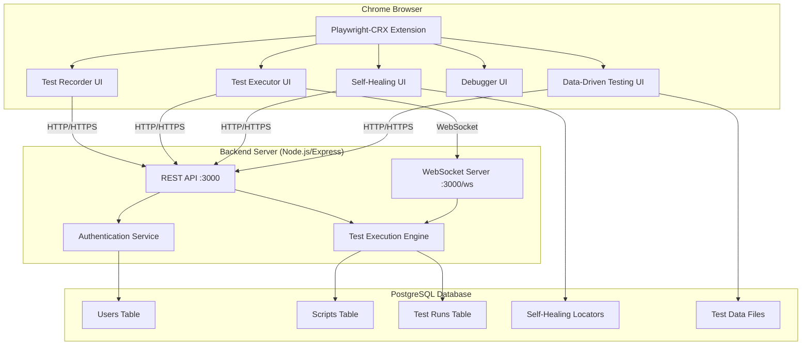

---

## 🔄 2. DATA FLOW DIAGRAM

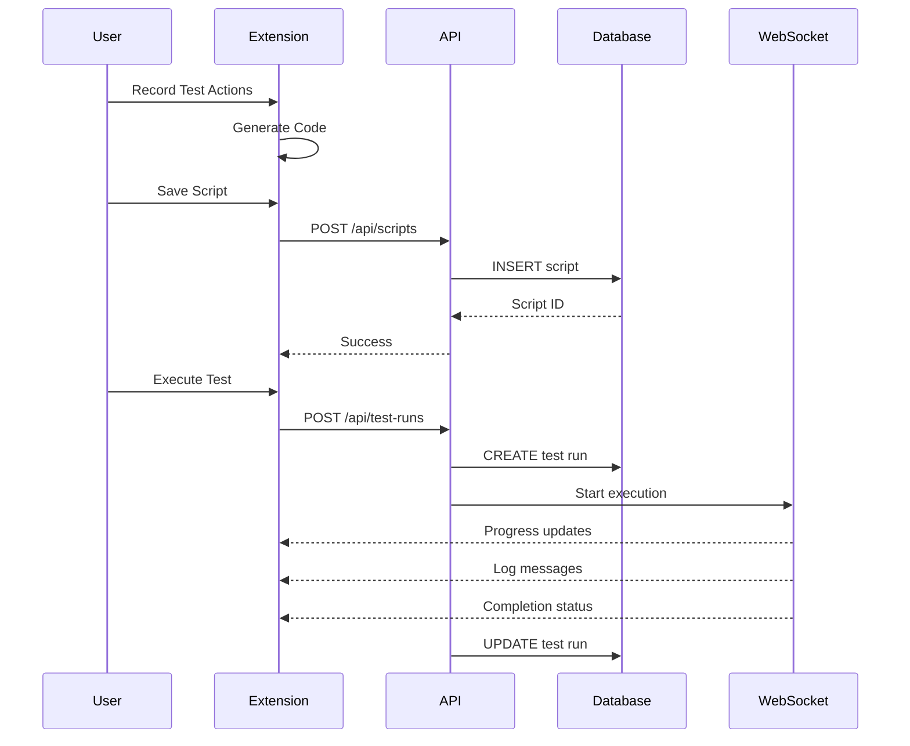

---

## 🧩 3. COMPONENT ARCHITECTURE

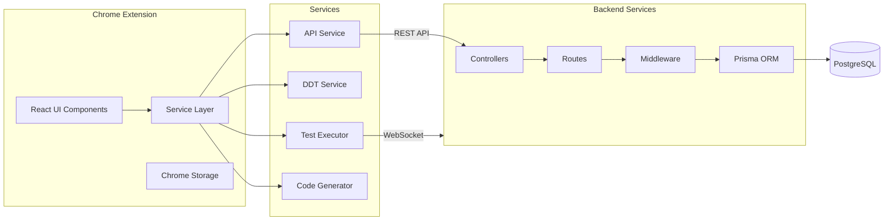

---

## 🔐 4. AUTHENTICATION FLOW

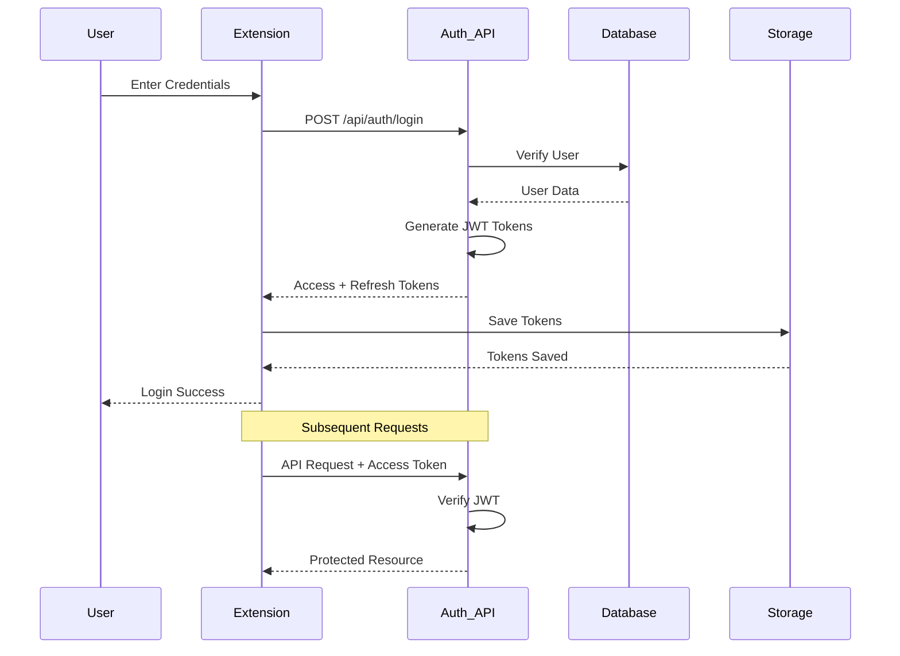

---

## 🧪 5. TEST EXECUTION FLOW

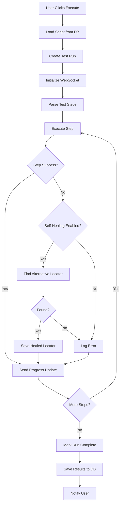

---

## 📦 6. DATABASE SCHEMA RELATIONSHIPS

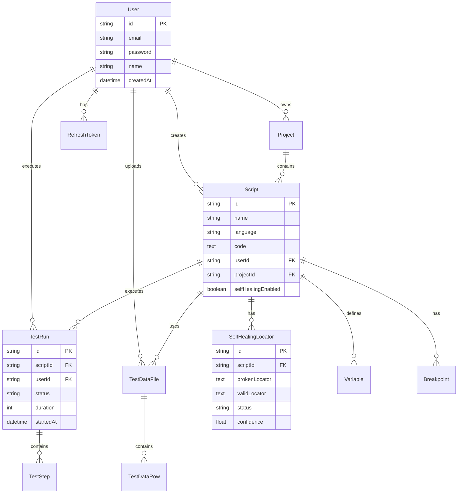

---

## 🌐 7. API ENDPOINT ARCHITECTURE

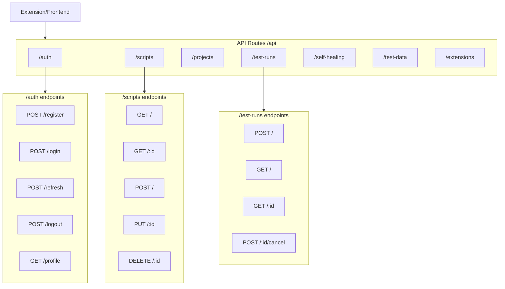

---

## 🔄 8. SELF-HEALING MECHANISM FLOW

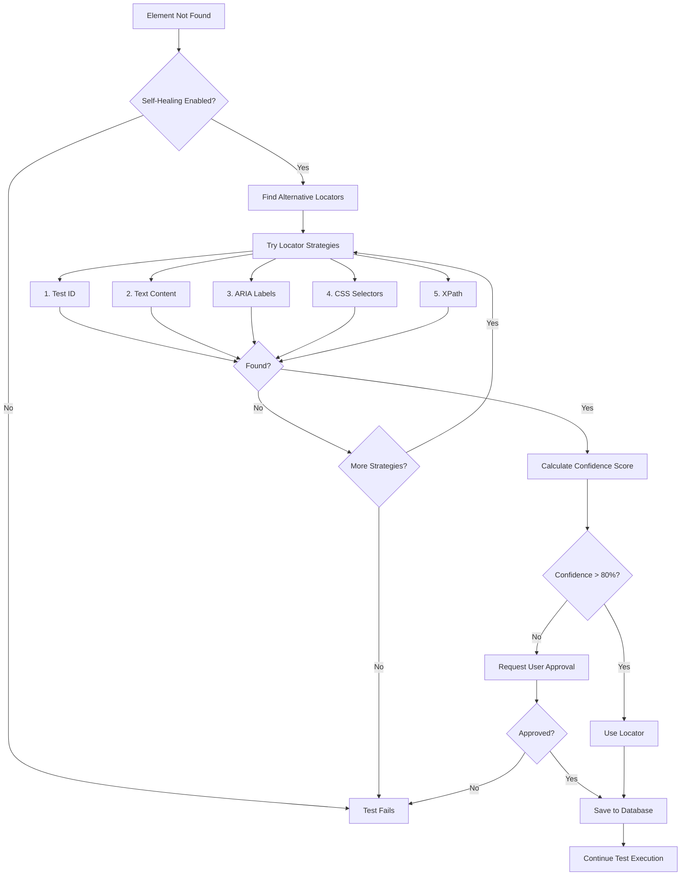

---

## 📁 9. PROJECT STRUCTURE

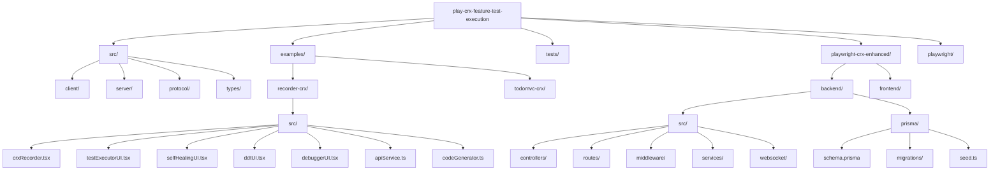

---

## 🚀 10. DEPLOYMENT ARCHITECTURE

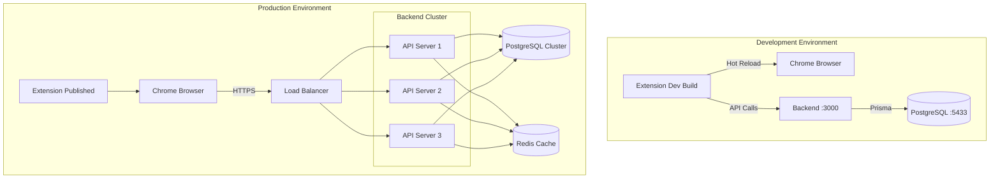

---

## 🔧 11. DATA-DRIVEN TESTING FLOW

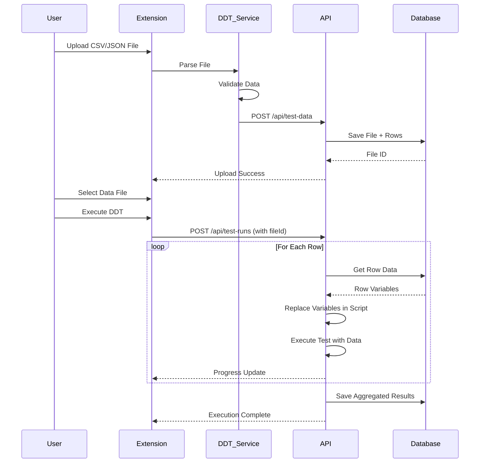

---

## 🎯 12. CODE GENERATION FLOW

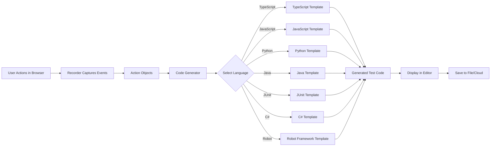

---

## 🛡️ 13. SECURITY ARCHITECTURE

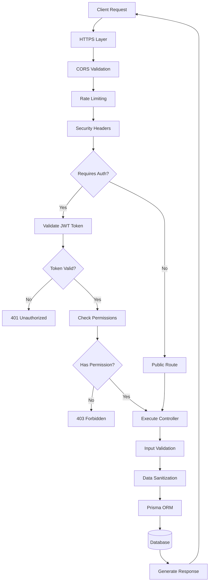

---

## 📊 14. MONITORING & LOGGING

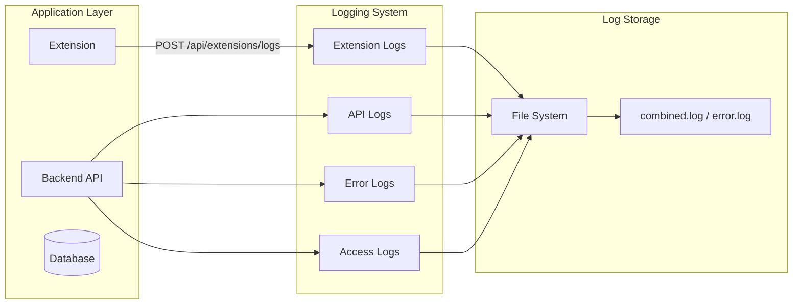

---

## 🎨 15. UI COMPONENT HIERARCHY

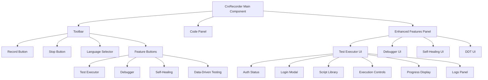

---

## 🎯 LEGEND

### Component Types
- **Rectangle**: Service/Component
- **Cylinder**: Database/Storage
- **Diamond**: Decision Point
- **Parallelogram**: Input/Output
- **Circle**: Start/End Point

### Connection Types
- **Solid Line**: Direct Connection
- **Dashed Line**: Async/Event-based
- **Arrow**: Data Flow Direction
- **Bidirectional**: Two-way Communication

---

## 📝 NOTES

1. **All diagrams are interactive** - View in Markdown preview supporting Mermaid
2. **Backend runs on port 3000** - Configurable via .env
3. **WebSocket uses same port** - Path: `/ws`
4. **Database connection** - Via Prisma ORM
5. **Authentication** - JWT-based with refresh tokens
6. **Real-time updates** - Via WebSocket for test execution

---

**Generated**: 2025-10-23
**Version**: 1.0.0
**Status**: Production Ready ✅
