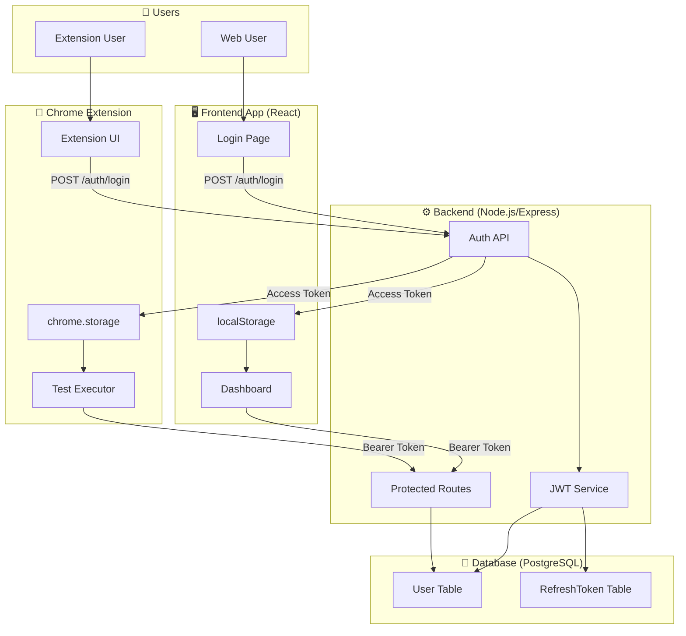
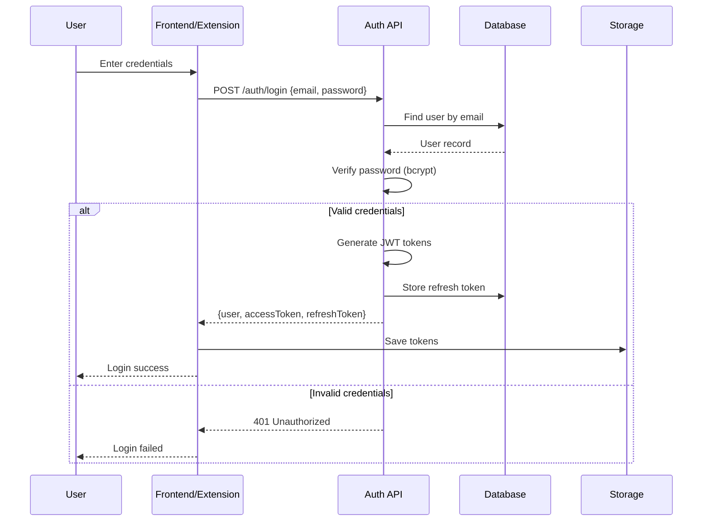
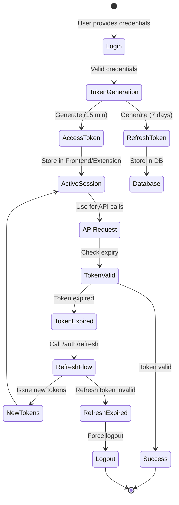
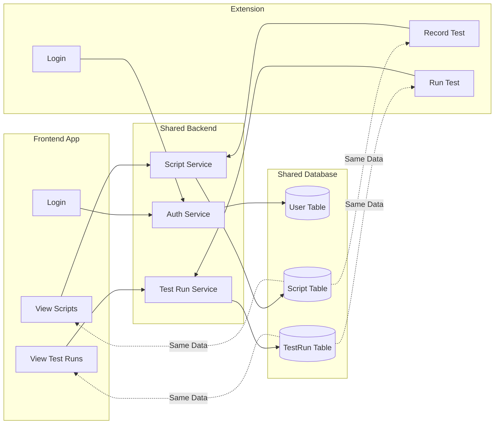
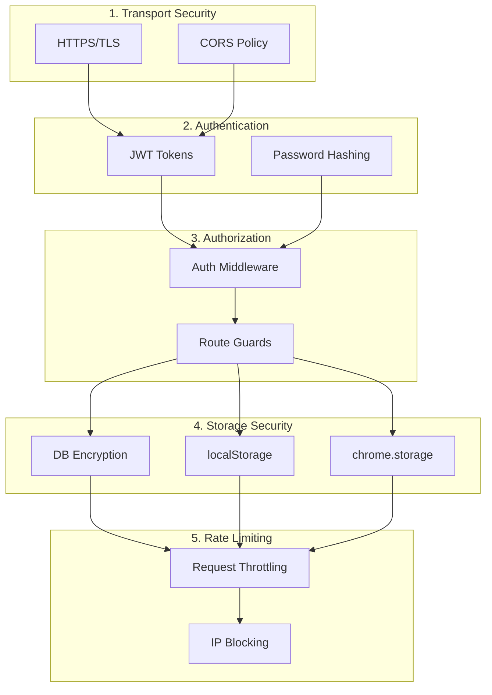
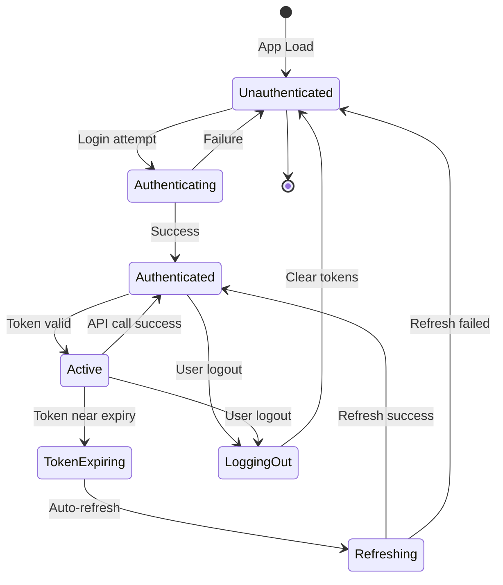

# 🏗️ Unified Authentication Architecture

**Visual guide to the authentication system**

---

## 🎯 System Overview



---

## 🔐 Authentication Flow

### Login Sequence



---

## 🎫 Token Management

### Token Lifecycle



---

## 🔄 Data Synchronization

### User Data Flow



---

## 🗄️ Database Schema

### User & Authentication Tables

```
┌─────────────────────────────────────────┐
│              User Table                 │
├─────────────────────────────────────────┤
│ id          String (UUID)      PK       │
│ email       String             UNIQUE   │
│ password    String (hashed)             │
│ name        String                      │
│ createdAt   DateTime                    │
│ updatedAt   DateTime                    │
│                                         │
│ Relations:                              │
│ - scripts[]      (one-to-many)          │
│ - testRuns[]     (one-to-many)          │
│ - refreshTokens[] (one-to-many)         │
└─────────────────────────────────────────┘

┌─────────────────────────────────────────┐
│         RefreshToken Table              │
├─────────────────────────────────────────┤
│ id          String (UUID)      PK       │
│ token       String             UNIQUE   │
│ userId      String             FK       │
│ expiresAt   DateTime                    │
│ createdAt   DateTime                    │
│                                         │
│ Relations:                              │
│ - user (many-to-one)                    │
└─────────────────────────────────────────┘
```

---

## 🌐 API Endpoints

### Authentication Routes

```
┌────────────────────────────────────────────────────┐
│              Auth API Endpoints                    │
├────────────────────────────────────────────────────┤
│                                                    │
│ POST /api/auth/register                            │
│   Body: {email, password, name}                    │
│   Returns: {user, tokens}                          │
│   Status: 201 Created                              │
│                                                    │
│ POST /api/auth/login                               │
│   Body: {email, password}                          │
│   Returns: {user, tokens}                          │
│   Status: 200 OK                                   │
│                                                    │
│ POST /api/auth/refresh                             │
│   Body: {refreshToken}                             │
│   Returns: {tokens}                                │
│   Status: 200 OK                                   │
│                                                    │
│ POST /api/auth/logout                              │
│   Body: {refreshToken}                             │
│   Returns: {message}                               │
│   Status: 200 OK                                   │
│                                                    │
└────────────────────────────────────────────────────┘
```

---

## 🔒 Security Layers

### Security Stack



---

## 📱 Client-Side Storage

### Storage Comparison

```
┌──────────────────────────────────────────────────────┐
│                  Frontend App                        │
├──────────────────────────────────────────────────────┤
│ Technology:   localStorage                           │
│ Scope:        Per domain/origin                      │
│ Persistence:  Until manually cleared                 │
│ Size Limit:   ~5-10 MB                               │
│ Access:       JavaScript only                        │
│                                                      │
│ Stored Data:                                         │
│   - accessToken: "eyJhbGciOiJIUzI1..."               │
│                                                      │
│ Security:                                            │
│   - XSS vulnerable                                   │
│   - Same-origin policy                               │
│   - HTTPS recommended                                │
└──────────────────────────────────────────────────────┘

┌──────────────────────────────────────────────────────┐
│               Chrome Extension                       │
├──────────────────────────────────────────────────────┤
│ Technology:   chrome.storage.local                   │
│ Scope:        Per extension                          │
│ Persistence:  Until extension uninstall/clear        │
│ Size Limit:   ~5 MB (unlimited with permission)      │
│ Access:       Extension context only                 │
│                                                      │
│ Stored Data:                                         │
│   - auth_tokens: {                                   │
│       accessToken: "eyJhbGciOiJIUzI1...",            │
│       refreshToken: "eyJhbGciOiJIUzI1..."            │
│     }                                                │
│                                                      │
│ Security:                                            │
│   - Isolated from web pages                          │
│   - Extension permission required                    │
│   - More secure than localStorage                    │
└──────────────────────────────────────────────────────┘
```

---

## 🔄 Session Management

### Session States



---

## 🌍 Network Architecture

### Request Flow

```
┌─────────────┐                    ┌─────────────┐
│   Frontend  │                    │  Extension  │
│  (Port 5174)│                    │  (Chrome)   │
└──────┬──────┘                    └──────┬──────┘
       │                                  │
       │ HTTP/HTTPS                       │ HTTP/HTTPS
       │                                  │
       └──────────────┬───────────────────┘
                      │
                      ▼
              ┌───────────────┐
              │  Backend API  │
              │  (Port 3000)  │
              └───────┬───────┘
                      │
                      │ TCP/IP
                      │
                      ▼
              ┌───────────────┐
              │  PostgreSQL   │
              │  (Port 5433)  │
              └───────────────┘
```

---

## 🎛️ Configuration Map

### Environment Variables

```
┌─────────────────────────────────────────────────────┐
│               Backend .env                          │
├─────────────────────────────────────────────────────┤
│ DATABASE_URL=postgresql://...                       │
│ JWT_ACCESS_SECRET=...                               │
│ JWT_REFRESH_SECRET=...                              │
│ PORT=3000                                           │
│ ALLOWED_ORIGINS=                                    │
│   chrome-extension://*,                             │
│   http://localhost:5174,                            │
│   http://localhost:3000                             │
└─────────────────────────────────────────────────────┘

┌─────────────────────────────────────────────────────┐
│          Frontend Configuration                     │
├─────────────────────────────────────────────────────┤
│ API_URL=http://localhost:3000/api                   │
│ (in App.tsx)                                        │
└─────────────────────────────────────────────────────┘

┌─────────────────────────────────────────────────────┐
│         Extension Configuration                     │
├─────────────────────────────────────────────────────┤
│ API_BASE_URL=http://localhost:3000/api              │
│ (in apiService.ts)                                  │
└─────────────────────────────────────────────────────┘
```

---

## 🎯 Summary

**Key Architectural Points:**

✅ **Single Backend** - One API serves both frontend and extension
✅ **Shared Database** - All users stored in one PostgreSQL database
✅ **JWT Tokens** - Industry-standard authentication
✅ **Bcrypt Hashing** - Secure password storage
✅ **Token Refresh** - Automatic session renewal
✅ **CORS Enabled** - Cross-origin resource sharing
✅ **Isolated Storage** - Frontend/Extension store tokens separately
✅ **Unified Experience** - Same credentials work everywhere

---

**Architecture Version**: 1.0.0
**Last Updated**: 2025-10-23
**Status**: Production Ready ✅
