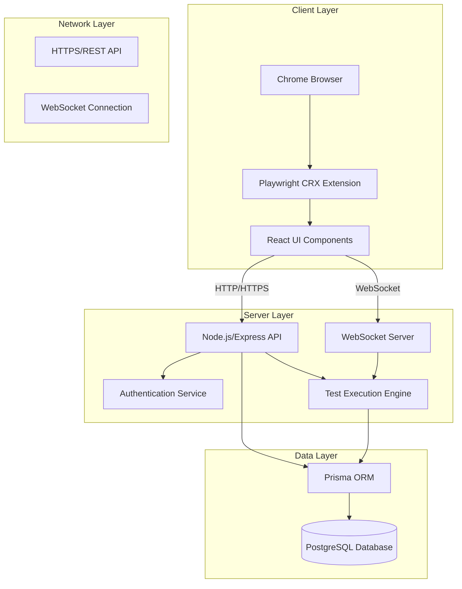
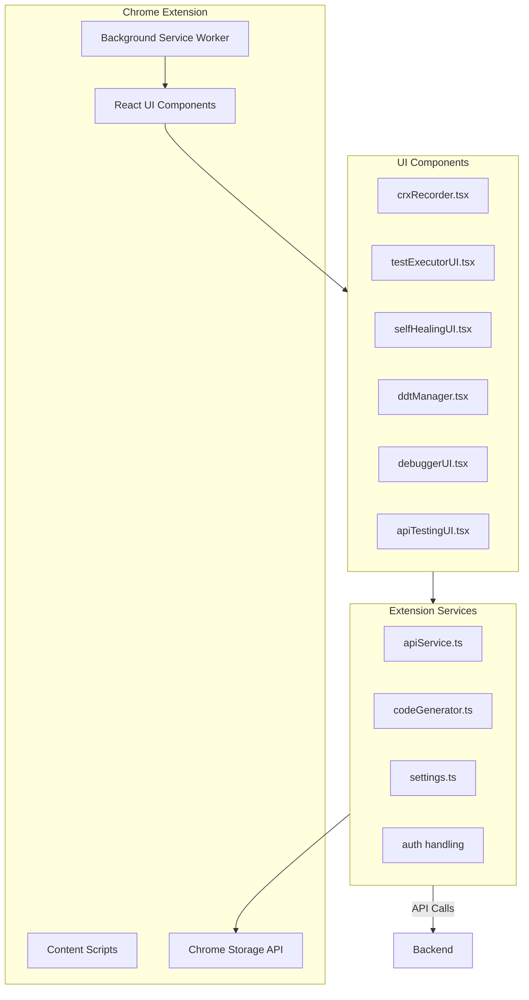
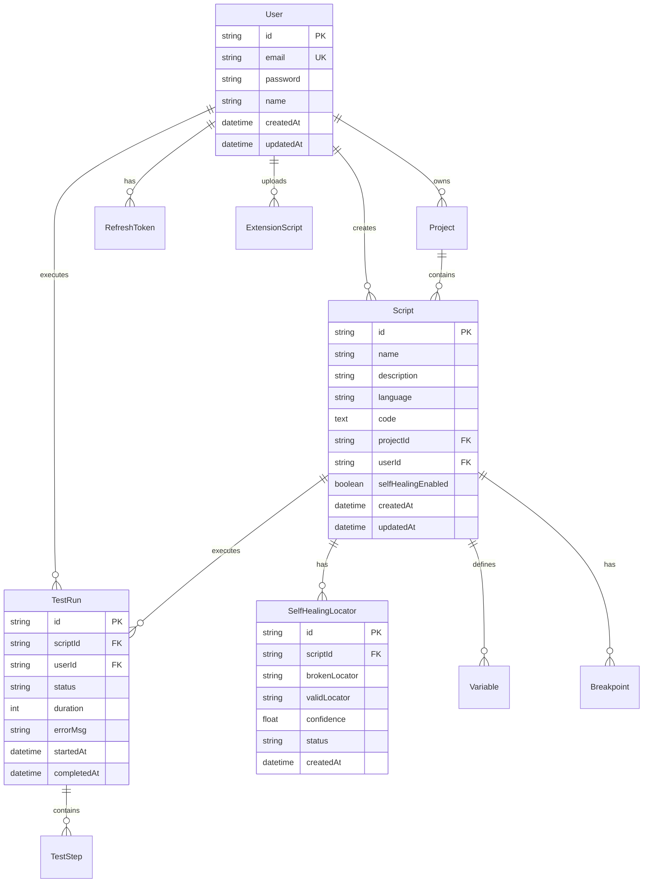
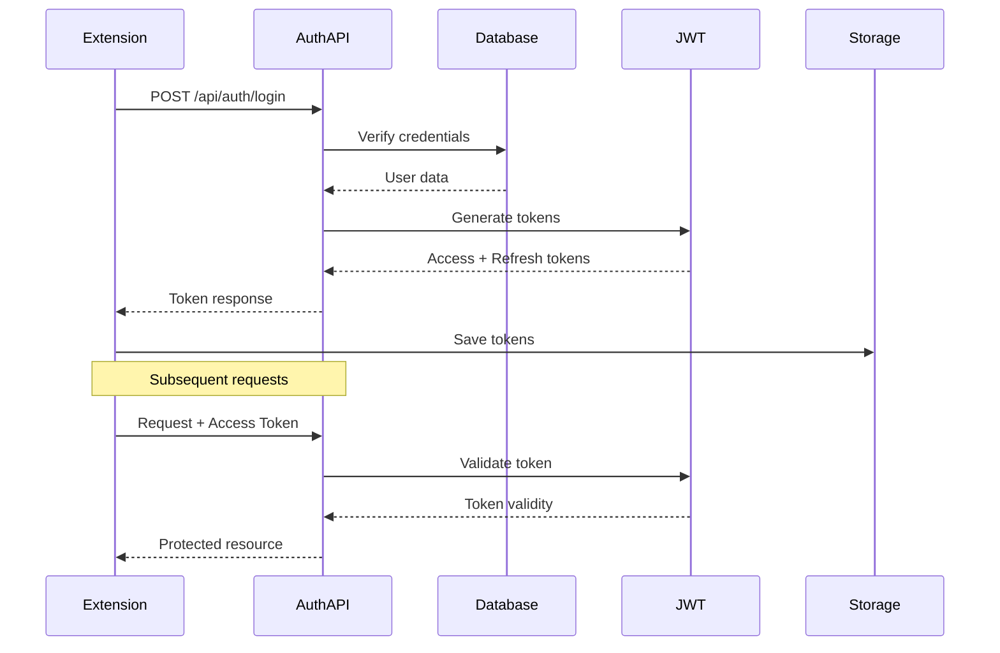
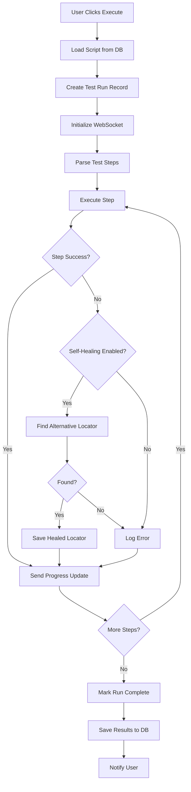
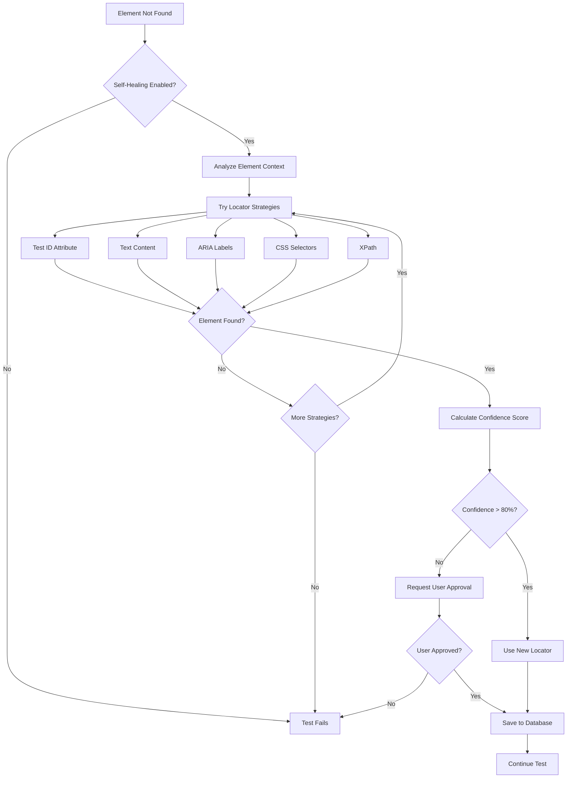
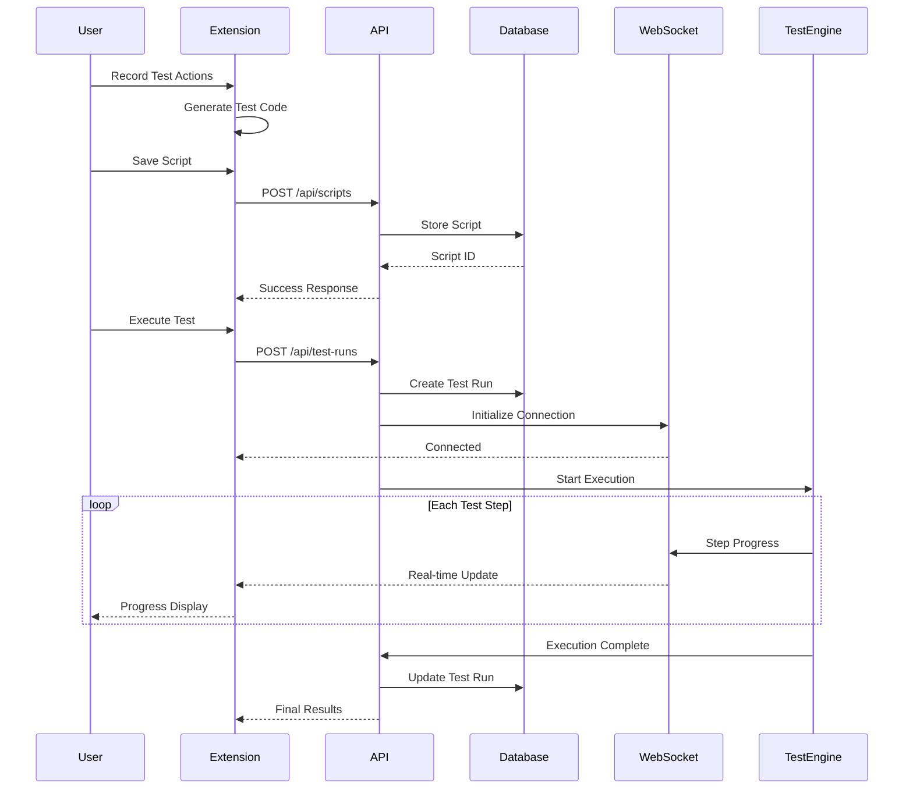
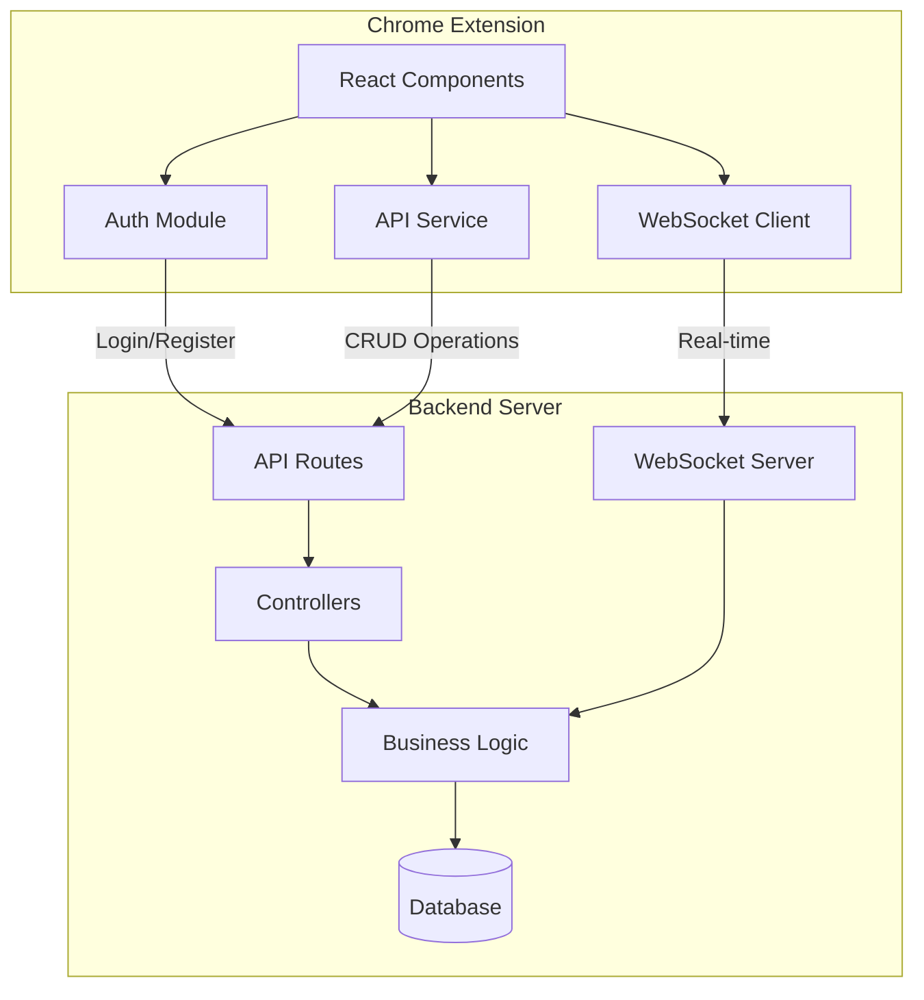
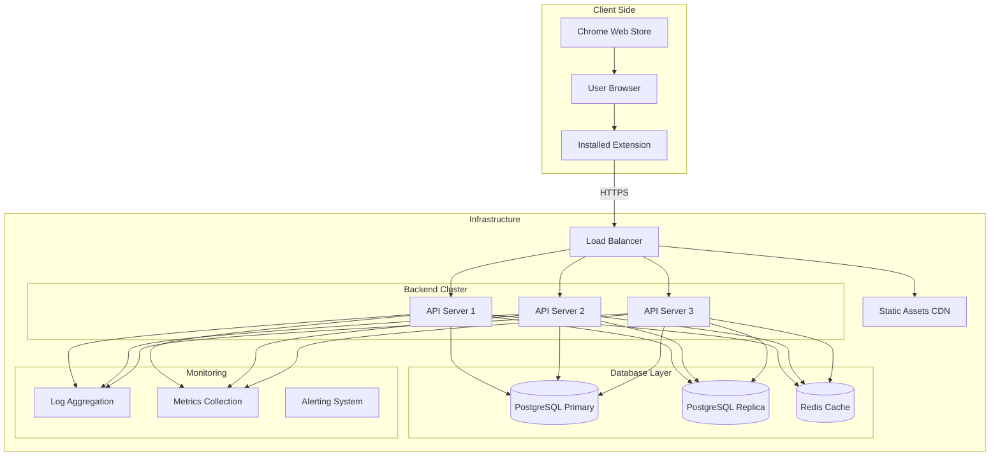

# 🏗️ Playwright CRX - End-to-End Architecture Documentation

**Version**: 1.0.0  
**Date**: 2025-10-29  
**Scope**: Complete workflow from Chrome Extension to Backend to Database

---

## 📋 Table of Contents

1. [System Overview](#1-system-overview)
2. [Chrome Extension Architecture](#2-chrome-extension-architecture)
3. [Backend API Architecture](#3-backend-api-architecture)
4. [Database Schema & Relationships](#4-database-schema--relationships)
5. [Authentication & Security Flow](#5-authentication--security-flow)
6. [Test Execution Workflow](#6-test-execution-workflow)
7. [Self-Healing Mechanism](#7-self-healing-mechanism)
8. [Data Flow Diagrams](#8-data-flow-diagrams)
9. [Component Interactions](#9-component-interactions)
10. [Deployment Architecture](#10-deployment-architecture)

---

## 1. SYSTEM OVERVIEW

### High-Level Architecture



### Core Components

1. **Chrome Extension**: Browser-based test recording and execution interface
2. **Backend API**: RESTful services for data management and test execution
3. **Database**: PostgreSQL for persistent storage of scripts, results, and user data
4. **WebSocket**: Real-time communication for test execution progress

---

## 2. CHROME EXTENSION ARCHITECTURE

### Extension Structure



### Key Extension Files

| Component | File | Purpose |
|-----------|------|---------|
| Main UI | [`crxRecorder.tsx`](examples/recorder-crx/src/crxRecorder.tsx) | Primary recorder interface with authentication |
| Test Executor | [`testExecutorUI.tsx`](examples/recorder-crx/src/testExecutorUI.tsx) | Test execution interface |
| Self-Healing | [`selfHealingUI.tsx`](examples/recorder-crx/src/selfHealingUI.tsx) | Self-healing configuration |
| API Service | [`apiService.ts`](examples/recorder-crx/src/apiService.ts) | Backend communication |
| Code Generator | [`codeGenerator.ts`](examples/recorder-crx/src/codeGenerator.ts) | Multi-language code generation |

### Extension Workflow

1. **Initialization**: Extension loads, checks authentication status
2. **Recording Mode**: Captures user interactions and generates test code
3. **Execution Mode**: Runs saved tests with real-time progress updates
4. **Storage**: Saves scripts locally or to backend database

---

## 3. BACKEND API ARCHITECTURE

### Backend Structure

```mermaid
graph LR
    subgraph Backend["Backend (Node.js/Express)"]
        subgraph Controllers["Controllers"]
            AuthCtrl[auth.controller.ts]
            ScriptCtrl[script.controller.ts]
            TestRunCtrl[testRun.controller.ts]
            ProjectCtrl[project.controller.ts]
            AllureCtrl[allure.controller.ts]
        end
        
        subgraph Services["Services"]
            AuthService[auth.service.ts]
            TestRunner[testRunner.service.ts]
            AllureService[allure.service.ts]
            SelfHealingService[selfHealing.service.ts]
        end
        
        subgraph Middleware["Middleware"]
            AuthMW[auth.middleware.ts]
            ValidationMW[validate.ts]
            ErrorMW[errorHandler.ts]
        end
        
        subgraph Routes["Routes"]
            AuthRoutes[auth.routes.ts]
            ScriptRoutes[script.routes.ts]
            TestRunRoutes[testRun.routes.ts]
        end
    end
    
    Routes --> Middleware
    Middleware --> Controllers
    Controllers --> Services
    Services --> Database
```



### API Endpoints

| Category | Endpoints | Purpose |
|----------|-----------|---------|
| Authentication | `/api/auth/*` | Login, register, token management |
| Scripts | `/api/scripts/*` | CRUD operations for test scripts |
| Test Runs | `/api/test-runs/*` | Test execution management |
| Projects | `/api/projects/*` | Project organization |
| Self-Healing | `/api/self-healing/*` | Locator healing strategies |
| Allure Reports | `/api/allure/*` | Test report generation |

### WebSocket Implementation

```typescript
// Real-time test execution updates
WebSocket.on('connection', (ws) => {
  ws.on('message', (message) => {
    // Handle test execution commands
    // Send progress updates
    // Stream logs and results
  });
});
```

---

## 4. DATABASE SCHEMA & RELATIONSHIPS

### Entity Relationship Diagram



### Key Tables

1. **Users**: Authentication and user management
2. **Scripts**: Test script storage with metadata
3. **TestRuns**: Execution history and results
4. **SelfHealingLocators**: Automatic locator healing data
5. **Projects**: Script organization and grouping

---

## 5. AUTHENTICATION & SECURITY FLOW

### Authentication Architecture



### Security Implementation

1. **JWT Tokens**: Access tokens (15min) + Refresh tokens (7days)
2. **Password Hashing**: bcrypt for secure password storage
3. **CORS Configuration**: Restricted to allowed origins
4. **Input Validation**: Comprehensive validation middleware
5. **Rate Limiting**: Prevent brute force attacks

---

## 6. TEST EXECUTION WORKFLOW

### Execution Flow



### Real-time Updates

- **WebSocket Events**: 
  - `test-start`: Test execution initiated
  - `step-progress`: Individual step completion
  - `test-complete`: Full test completion
  - `error`: Execution errors

---

## 7. SELF-HEALING MECHANISM

### Self-Healing Strategy



### Healing Process

1. **Detection**: Element not found with original locator
2. **Analysis**: Examine DOM structure and element attributes
3. **Strategy Application**: Try multiple locator strategies in priority order
4. **Confidence Scoring**: Calculate match confidence
5. **Persistence**: Save successful alternatives for future use

---

## 8. DATA FLOW DIAGRAMS

### Complete Data Flow



---

## 9. COMPONENT INTERACTIONS

### Extension-Backend Communication



### Key Interactions

1. **Authentication Flow**: Extension ↔ Auth Controller ↔ User Table
2. **Script Management**: Extension ↔ Script Controller ↔ Script Table
3. **Test Execution**: Extension ↔ WebSocket ↔ Test Runner Service
4. **Self-Healing**: Test Engine ↔ Self-Healing Service ↔ Locator Table

---

## 10. DEPLOYMENT ARCHITECTURE

### Production Deployment



### Environment Configuration

| Environment | Database | Backend URL | Extension Source |
|------------|----------|-------------|------------------|
| Development | Local PostgreSQL | http://localhost:3000 | Local build |
| Staging | Staging DB | https://staging-api.example.com | Staging build |
| Production | PostgreSQL Cluster | https://api.example.com | Chrome Web Store |

---

## 🔧 TECHNOLOGY STACK

### Frontend (Extension)
- **Framework**: React 18 with TypeScript
- **Build Tool**: Vite
- **UI**: Custom CSS with VS Code theme
- **State Management**: React Hooks
- **Communication**: Fetch API + WebSocket

### Backend
- **Runtime**: Node.js 18+
- **Framework**: Express.js
- **Language**: TypeScript
- **Authentication**: JWT + bcrypt
- **Database ORM**: Prisma
- **Real-time**: WebSocket (ws library)

### Database
- **Primary**: PostgreSQL 14+
- **Caching**: Redis (optional)
- **Migrations**: Prisma Migrate
- **Seeding**: Custom seed scripts

### DevOps
- **Containerization**: Docker
- **Process Management**: PM2
- **Monitoring**: Winston (logs)
- **Testing**: Jest + Playwright Test

---

## 📊 PERFORMANCE CONSIDERATIONS

### Extension Optimization
- Lazy loading of UI components
- Efficient state management
- Minimal background processing
- Optimized bundle size

### Backend Optimization
- Database connection pooling
- Query optimization with indexes
- Response caching where appropriate
- WebSocket connection management

### Database Optimization
- Strategic indexing on frequently queried columns
- Connection pooling
- Read replicas for scaling
- Regular maintenance and cleanup

---

## 🛡️ SECURITY MEASURES

1. **Input Validation**: Comprehensive validation on all inputs
2. **SQL Injection Prevention**: Prisma ORM parameterized queries
3. **XSS Protection**: Content Security Policy in extension
4. **Authentication**: Secure JWT implementation
5. **HTTPS Only**: Enforce secure communication
6. **Rate Limiting**: Prevent abuse and brute force

---

## 🔄 FUTURE SCALABILITY

### Horizontal Scaling
- Stateless API design for easy scaling
- Load balancer support
- Database read replicas
- Microservices potential

### Feature Expansion
- Plugin architecture for custom test frameworks
- Additional browser support
- Cloud execution environments
- Advanced analytics and reporting

---

**Document Status**: Complete ✅  
**Last Updated**: 2025-10-29  
**Next Review**: 2025-11-29