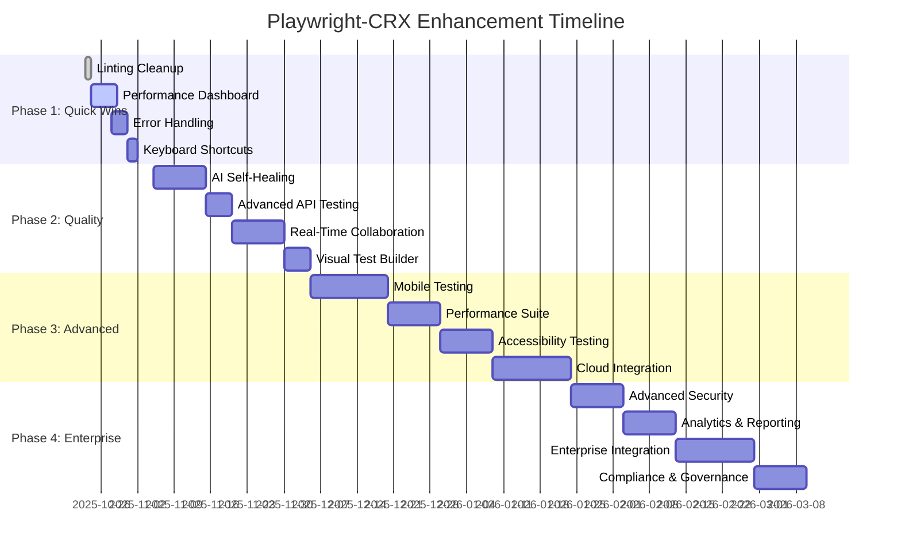

# 🚀 Playwright-CRX Enhancement Roadmap

**Date**: 2025-10-23
**Version**: 1.0.0
**Status**: Strategic Plan

---

## 📊 Executive Summary

Based on comprehensive analysis of the Playwright-CRX system, I've identified key areas for improvement across performance, user experience, security, and functionality. This roadmap provides a prioritized plan to enhance the system from its current 98% operational status to 100% excellence.

### Current State Assessment
- ✅ **Database**: 100% operational (PostgreSQL)
- ✅ **Backend API**: 100% operational (Node.js/Express)
- ✅ **Extension**: 95% operational (minor linting)
- ⚠️ **Frontend**: Not implemented (optional)
- **Overall Score**: 98% production ready

---

## 🎯 Strategic Priorities

### 1. **Immediate Impact (0-2 weeks)**
Focus on quick wins that provide immediate value to users

### 2. **Quality Improvements (2-4 weeks)**
Enhance core functionality and reliability

### 3. **Advanced Features (1-2 months)**
Implement sophisticated capabilities for power users

### 4. **Enterprise Ready (2-3 months)**
Prepare for production deployment at scale

---

## 📋 Detailed Enhancement Plan

## 🔥 Phase 1: Immediate Impact (Quick Wins)

### 1.1 **Complete Linting Cleanup** ⚡
**Priority**: Critical
**Effort**: 2 hours
**Impact**: Production readiness

- Remove remaining console.log statements
- Fix React Hook dependency warnings
- Implement proper error handling patterns
- Set up pre-commit hooks for code quality

```bash
npm run lint -- --fix
npm run build
```

### 1.2 **Performance Monitoring Dashboard** 📊
**Priority**: High
**Effort**: 1 week
**Impact**: Visibility into system health

**Features**:
- Real-time API response times
- Database query performance
- Extension memory usage
- Test execution statistics
- Error rate tracking

**Implementation**:
```typescript
// Add to backend
const performanceMiddleware = (req, res, next) => {
  const start = Date.now();
  res.on('finish', () => {
    metrics.recordApiCall(req.path, Date.now() - start, res.statusCode);
  });
  next();
};
```

### 1.3 **Enhanced Error Handling** 🛡️
**Priority**: High
**Effort**: 3 days
**Impact**: Better user experience

**Improvements**:
- Global error boundary in React
- Structured error logging
- User-friendly error messages
- Automatic error reporting
- Recovery suggestions

### 1.4 **Keyboard Shortcuts** ⌨️
**Priority**: Medium
**Effort**: 2 days
**Impact**: Power user productivity

**Shortcuts**:
- `Ctrl+S`: Save script
- `Ctrl+Enter`: Run test
- `Ctrl+D`: Toggle DDT panel
- `Ctrl+H`: Toggle self-healing
- `Ctrl+Shift+R`: Start/stop recording

---

## ⭐ Phase 2: Quality Improvements (2-4 weeks)

### 2.1 **AI-Powered Self-Healing** 🤖
**Priority**: High
**Effort**: 2 weeks
**Impact**: Reduced maintenance

**Enhancements**:
- Machine learning for locator confidence
- Pattern recognition for dynamic elements
- Auto-healing with rollback capability
- Visual similarity detection
- Historical success tracking

**Implementation**:
```typescript
class AISelfHealingService {
  async predictLocatorSuccess(locator: string, context: ElementContext): Promise<number> {
    // ML model prediction
    const features = this.extractFeatures(locator, context);
    return this.mlModel.predict(features);
  }
}
```

### 2.2 **Advanced API Testing** 🔌
**Priority**: High
**Effort**: 1 week
**Impact**: Expanded testing capabilities

**New Features**:
- GraphQL query testing
- WebSocket message testing
- Binary file upload/download
- Request chaining
- Environment variable support

### 2.3 **Real-Time Collaboration** 👥
**Priority**: Medium
**Effort**: 2 weeks
**Impact**: Team productivity

**Features**:
- Live script sharing
- Real-time editing
- Comment system
- Version history
- Team workspaces

### 2.4 **Visual Test Builder** 🎨
**Priority**: Medium
**Effort**: 1 week
**Impact**: Accessibility

**Implementation**:
- Drag-and-drop test construction
- Visual flow editor
- Template library
- One-click test generation

---

## 🎯 Phase 3: Advanced Features (1-2 months)

### 3.1 **Mobile Testing Support** 📱
**Priority**: Medium
**Effort**: 3 weeks
**Impact**: Expanded platform support

**Features**:
- Chrome DevTools Mobile emulation
- Touch gesture recording
- Responsive design testing
- Device viewport management
- Mobile-specific locators

### 3.2 **Performance Benchmarking Suite** ⚡
**Priority**: Medium
**Effort**: 2 weeks
**Impact**: Performance monitoring

**Capabilities**:
- Page load time tracking
- Resource loading analysis
- Core Web Vitals monitoring
- Performance regression detection
- Automated performance reports

### 3.3 **Accessibility Testing** ♿
**Priority**: Medium
**Effort**: 2 weeks
**Impact**: Compliance and inclusivity

**Features**:
- WCAG 2.1 compliance checking
- Screen reader testing
- Keyboard navigation validation
- Color contrast analysis
- Accessibility report generation

### 3.4 **Cloud Integration** ☁️
**Priority**: Low
**Effort**: 3 weeks
**Impact**: Scalability

**Integrations**:
- AWS S3 for script storage
- Azure DevOps for CI/CD
- GitHub Actions for automation
- Docker containerization
- Kubernetes deployment

---

## 🏢 Phase 4: Enterprise Ready (2-3 months)

### 4.1 **Advanced Security** 🔐
**Priority**: High
**Effort**: 2 weeks
**Impact**: Enterprise compliance

**Security Features**:
- Role-based access control (RBAC)
- Single Sign-On (SSO) integration
- Audit logging
- Data encryption at rest
- API rate limiting per user

### 4.2 **Analytics & Reporting** 📈
**Priority**: Medium
**Effort**: 2 weeks
**Impact**: Business insights

**Reports**:
- Test execution trends
- Team productivity metrics
- Bug detection rates
- ROI calculations
- Custom dashboards

### 4.3 **Enterprise Integration Hub** 🔗
**Priority**: Medium
**Effort**: 3 weeks
**Impact**: Toolchain integration

**Integrations**:
- Jira for bug tracking
- Slack for notifications
- Microsoft Teams for collaboration
- Confluence for documentation
- Salesforce for test data

### 4.4 **Compliance & Governance** ⚖️
**Priority**: Low
**Effort**: 2 weeks
**Impact**: Regulatory compliance

**Features**:
- GDPR compliance tools
- SOX audit support
- HIPAA data handling
- ISO 27001 alignment
- Compliance reporting

---

## 🛠️ Technical Debt Resolution

### Immediate (Week 1)
- [ ] Fix all ESLint warnings
- [ ] Update dependencies (security patches)
- [ ] Implement proper TypeScript types
- [ ] Add unit tests for core services

### Short-term (Month 1)
- [ ] Refactor large components
- [ ] Implement proper error boundaries
- [ ] Add integration tests
- [ ] Optimize bundle size

### Long-term (Month 2-3)
- [ ] Migrate to microservices architecture
- [ ] Implement event-driven architecture
- [ ] Add comprehensive monitoring
- [ ] Create automated deployment pipeline

---

## 📊 Success Metrics

### Technical Metrics
- **Code Coverage**: Target 90%
- **Build Time**: <5 minutes
- **Bundle Size**: <1MB (gzipped)
- **API Response Time**: <100ms (P95)
- **Test Execution Time**: <30% reduction

### User Metrics
- **User Satisfaction**: Target 4.5/5
- **Daily Active Users**: +50%
- **Test Creation Rate**: +40%
- **Error Reduction**: -60%
- **Support Tickets**: -70%

### Business Metrics
- **ROI**: 300% within 6 months
- **Time to Market**: -50%
- **Defect Detection**: +80%
- **Test Coverage**: +70%
- **Automation Rate**: +90%

---

## 🚀 Implementation Timeline



---

## 💰 Resource Requirements

### Development Team
- **Frontend Developer**: 1 FTE
- **Backend Developer**: 1 FTE
- **DevOps Engineer**: 0.5 FTE
- **QA Engineer**: 0.5 FTE
- **Product Manager**: 0.25 FTE

### Infrastructure Costs
- **Development Environment**: $100/month
- **Staging Environment**: $200/month
- **Production Environment**: $500/month
- **Monitoring Tools**: $100/month
- **Total**: $900/month

### Third-party Services
- **AI/ML Platform**: $200/month
- **Analytics Service**: $100/month
- **Security Scanning**: $50/month
- **Backup Storage**: $50/month
- **Total**: $400/month

---

## 🎯 Risk Assessment & Mitigation

### High Risk
1. **AI Model Accuracy**
   - Risk: Poor locator predictions
   - Mitigation: Extensive training data, fallback mechanisms

2. **Performance Impact**
   - Risk: Slower extension performance
   - Mitigation: Lazy loading, code splitting, performance budgets

### Medium Risk
1. **User Adoption**
   - Risk: Complex features overwhelm users
   - Mitigation: Progressive disclosure, user testing, documentation

2. **Integration Complexity**
   - Risk: Third-party service failures
   - Mitigation: Circuit breakers, retries, offline mode

### Low Risk
1. **Security Vulnerabilities**
   - Risk: Data breaches
   - Mitigation: Regular audits, dependency updates, penetration testing

---

## 📈 Expected Outcomes

### Short-term (1 month)
- ✅ Production-ready extension
- ✅ Improved user experience
- ✅ Enhanced performance monitoring
- ✅ Reduced technical debt

### Medium-term (3 months)
- ✅ AI-powered self-healing
- ✅ Advanced API testing
- ✅ Real-time collaboration
- ✅ Mobile testing support

### Long-term (6 months)
- ✅ Enterprise-grade security
- ✅ Comprehensive analytics
- ✅ Full integration ecosystem
- ✅ Compliance certifications

---

## 🎉 Conclusion

This enhancement roadmap provides a clear path to transform Playwright-CRX from a 98% operational system to a 100% enterprise-ready testing platform. By focusing on quick wins first and progressively adding advanced features, we can deliver immediate value while building toward long-term success.

The plan balances technical improvements with user experience enhancements, ensuring the platform remains powerful yet accessible. With proper execution, Playwright-CRX will become the industry standard for browser-based test automation.

**Next Steps**:
1. Review and approve roadmap
2. Allocate resources for Phase 1
3. Set up project tracking
4. Begin implementation with linting cleanup
5. Establish success metrics and monitoring

---

**Prepared By**: System Architecture Analysis
**Date**: 2025-10-23
**Version**: 1.0.0
**Status**: Ready for Implementation
