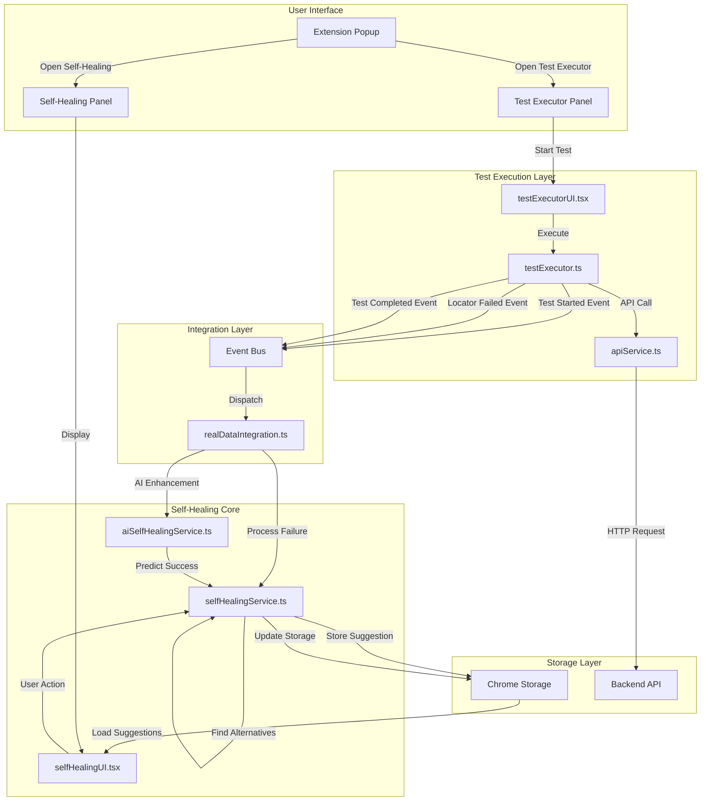
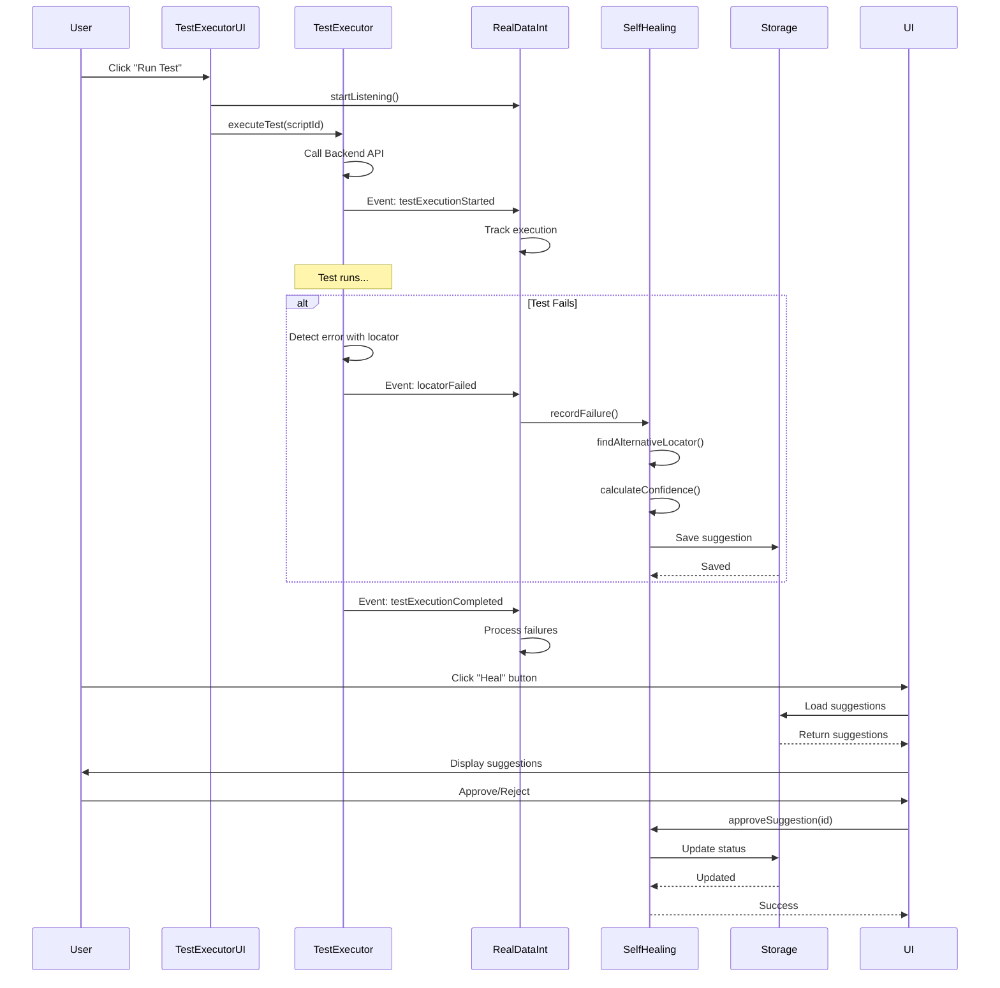
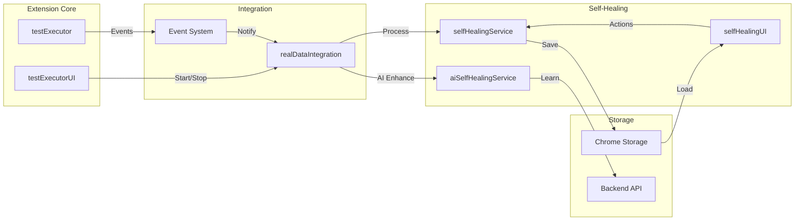
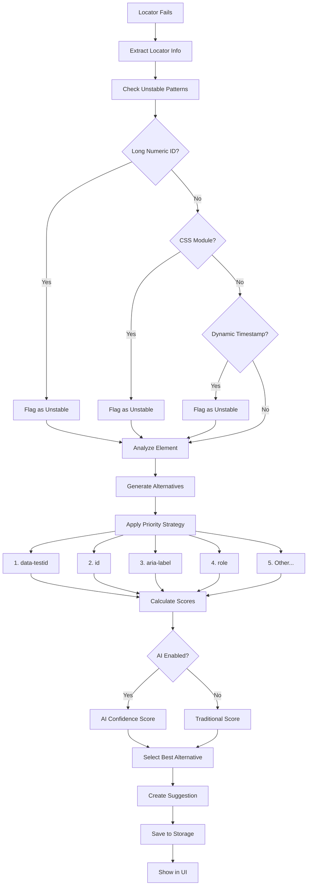
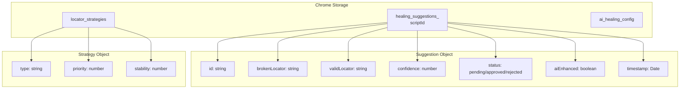
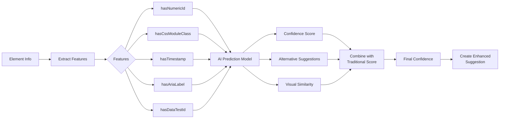
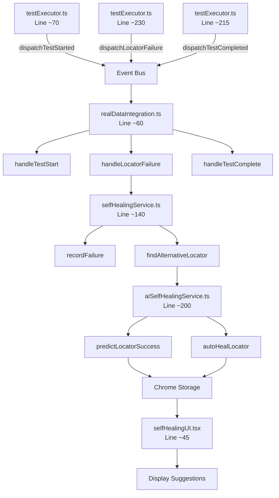
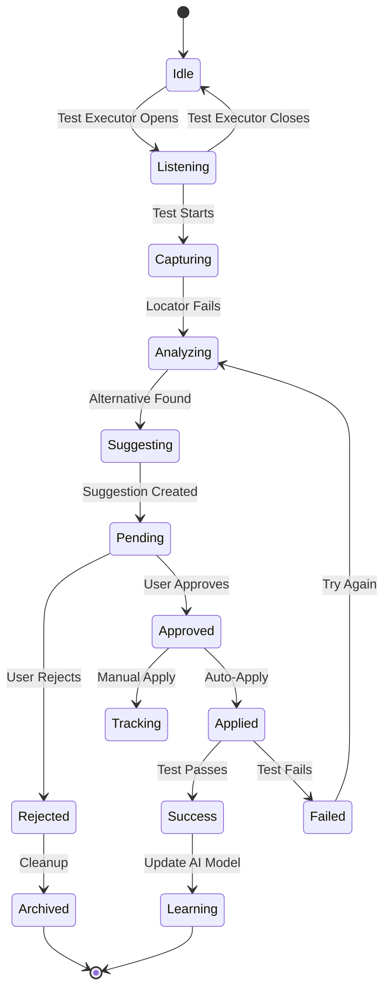
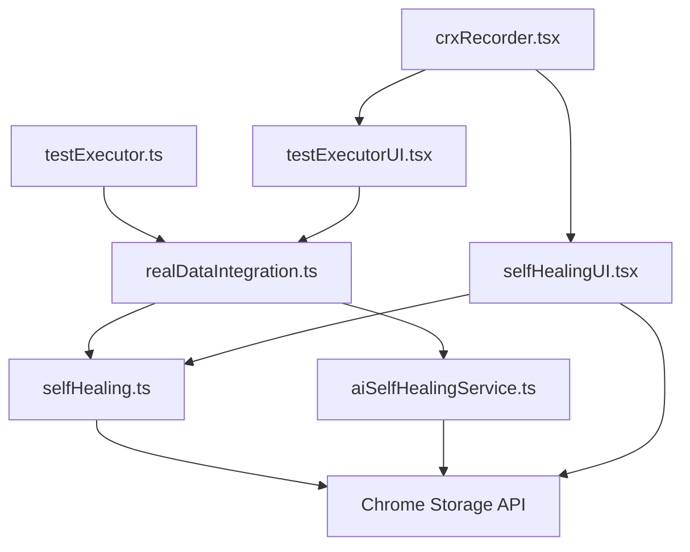

# Self-Healing Architecture Diagram

## Complete System Architecture

## Event Flow Diagram

## Data Flow

```mermaid
flowchart LR
    A[Test Fails] --> B{Error Contains<br/>Locator?}
    B -->|Yes| C[Extract Locator]
    B -->|No| D[Generic Error]
    
    C --> E[Dispatch Event]
    E --> F[realDataIntegration<br/>Captures]
    F --> G[selfHealingService<br/>Analyzes]
    
    G --> H{AI Enabled?}
    H -->|Yes| I[aiSelfHealingService<br/>Enhanced Analysis]
    H -->|No| J[Traditional Analysis]
    
    I --> K[Find Alternatives]
    J --> K
    
    K --> L[Calculate Confidence]
    L --> M[Create Suggestion]
    M --> N[Store in Chrome Storage]
    N --> O[Display in UI]
    
    O --> P{User Action}
    P -->|Approve| Q[Increase Confidence]
    P -->|Reject| R[Mark Rejected]
    
    Q --> S[Track Success]
    R --> T[Track Rejection]
```

## Component Interaction

## Locator Healing Process

## Storage Structure

## AI Enhancement Flow

## Integration Points

## State Management

## File Dependencies

## Summary

### Key Components:
1. **testExecutor.ts** - Dispatches events when tests fail
2. **testExecutorUI.tsx** - Starts/stops listening for events
3. **realDataIntegration.ts** - Captures events and triggers healing
4. **selfHealingService.ts** - Core healing logic
5. **aiSelfHealingService.ts** - AI enhancement layer
6. **selfHealingUI.tsx** - User interface for suggestions
7. **Chrome Storage** - Persistence layer

### Event Types:
- `testExecutionStarted` - Test begins
- `locatorFailed` - Locator fails with error
- `locatorHealed` - Healing successful
- `testExecutionCompleted` - Test finishes

### Data Flow:
Test Fails → Extract Locator → Dispatch Event → Capture → Analyze → Find Alternative → Calculate Confidence → Create Suggestion → Store → Display → User Action → Update

### Storage Keys:
- `healing_suggestions_<scriptId>` - Suggestions per script
- `locator_strategies` - Prioritized strategies
- `ai_healing_config` - AI configuration

---

**Architecture Status:** 🟢 **Complete and Operational**
