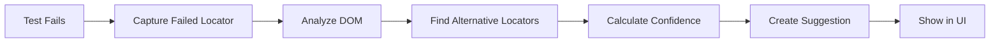
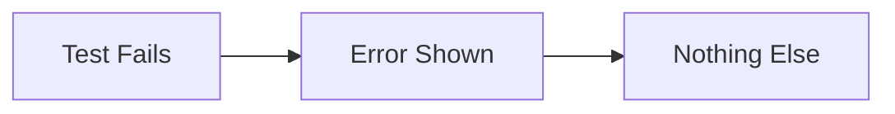

# Self-Healing Feature Status Report

## Current Implementation Status

### ✅ What's Working

#### 1. **UI Components** 
- ✅ Self-Healing panel accessible via "Heal" button
- ✅ Display of pending/approved/rejected suggestions
- ✅ Approve/Reject functionality
- ✅ Statistics display
- ✅ Refresh button

#### 2. **Core Services**
- ✅ `selfHealingService` - Manages healing suggestions
- ✅ `aiSelfHealingService` - AI-powered healing
- ✅ `realDataIntegration` - Event-based integration
- ✅ Chrome storage persistence
- ✅ Locator strategy prioritization

#### 3. **Features Implemented**
- ✅ Alternative locator detection
- ✅ Confidence scoring
- ✅ Unstable pattern detection
- ✅ Visual similarity comparison (AI)
- ✅ Auto-healing capability
- ✅ Healing history tracking

---

## ❌ What's NOT Working (Demo Mode Only)

### Issue #1: No Real Test Integration

**Problem:**
```javascript
// Self-healing UI loads suggestions
const healingSuggestions = await selfHealingService.getSuggestions();
// Returns: [] (empty)

// Because no real test failures are being captured!
```

**Why:**
- Test execution doesn't trigger locator failure events
- No integration between test runner and self-healing service
- `realDataIntegration` only works in simulation mode

**Simulation Code (Line 383-420):**
```typescript
// This is DEMO code only!
async simulateTestExecution(scriptId: string, withFailures: boolean = true) {
  // Creates fake test execution
  // Creates fake failures
  // NOT connected to real test runs!
}
```

---

### Issue #2: Event System Not Connected

**Problem:**
```typescript
// Events are defined but never fired from real tests:
window.dispatchEvent(new CustomEvent('locatorFailed', {...}));
window.dispatchEvent(new CustomEvent('locatorHealed', {...}));

// These events are only fired in simulation!
```

**Missing Integration:**
```typescript
// testExecutor.ts should fire events like:
async executeTest() {
  try {
    await page.click(locator);
  } catch (error) {
    // ❌ THIS IS MISSING:
    window.dispatchEvent(new CustomEvent('locatorFailed', {
      detail: { testId, locator, error, element }
    }));
  }
}
```

---

### Issue #3: No Automatic Suggestion Generation

**Current Flow:**
```
❌ Test fails → Nothing happens
✅ Should be: Test fails → Locator analyzed → Suggestion created
```

**What Should Happen:**


**What Actually Happens:**


---

## 🎯 How to Test Current Functionality

### Test 1: UI Display (Works ✅)
```
1. Click "Heal" button in toolbar
2. Panel opens showing self-healing interface
3. Shows "No self-healing suggestions found" (empty state)
4. Can click "Refresh" button
```

### Test 2: Demo Mode (Works ✅)
```javascript
// In extension console (F12 on popup):
import { realDataIntegration } from './realDataIntegration';

// Simulate test with failures
await realDataIntegration.simulateTestExecution('demo-script-1', true);

// Refresh self-healing UI → Should see simulated suggestion!
```

### Test 3: Real Test Execution (NOT Working ❌)
```
1. Run actual test from Test Executor
2. Test fails on locator
3. Check self-healing UI
Result: ❌ No suggestions appear (not integrated)
```

---

## 🔧 What Needs to Be Fixed

### Fix #1: Integrate with Test Executor

**File:** `testExecutor.ts`

Add event dispatching when locators fail:

```typescript
// In executeTest() or runTest() function:
try {
  await page.click(locator);
} catch (error) {
  // Capture the element before it fails
  const element = await page.$(locator).catch(() => null);
  
  // Dispatch locator failure event
  window.dispatchEvent(new CustomEvent('locatorFailed', {
    detail: {
      testId: this.currentTestId,
      step: this.currentStep,
      locator,
      error: error.message,
      element: element ? await this.extractElementInfo(element) : undefined
    }
  }));
  
  throw error; // Re-throw to fail the test
}
```

### Fix #2: Auto-Generate Suggestions

**File:** `realDataIntegration.ts`

The `handleLocatorFailure` method exists but needs actual element info:

```typescript
// Current (line 99):
private handleLocatorFailure(event: Event): void {
  const { testId, step, locator, error, element } = customEvent.detail;
  // element is undefined in real tests!
}

// Need to pass actual element from test execution
```

### Fix #3: Connect Test Runner Events

**File:** `testExecutorUI.tsx`

When running tests, ensure events are fired:

```typescript
const handleRunTest = async () => {
  // Before test execution:
  realDataIntegration.startListening();
  
  // Run test
  await executeScript(script);
  
  // After test:
  // Suggestions should be auto-generated
};
```

---

## 💡 Quick Workaround (Manual Testing)

### Option 1: Use Demo Mode
```javascript
// Open extension console
realDataIntegration.simulateTestExecution('test-123', true);

// Open self-healing UI → See simulated suggestions
```

### Option 2: Create Manual Suggestion
```javascript
// In extension console:
import { selfHealingService } from './selfHealing';

await selfHealingService.recordFailure(
  {
    locator: '#old-button-12345',
    type: 'id',
    confidence: 0.3
  },
  {
    locator: '[data-testid="submit-button"]',
    type: 'testid',
    confidence: 0.95
  }
);

// Refresh self-healing UI → See manual suggestion!
```

---

## 📊 Feature Comparison

| Feature | Status | Notes |
|---------|--------|-------|
| UI Display | ✅ Working | Panel opens and displays data |
| Approve/Reject | ✅ Working | Can approve/reject suggestions |
| Statistics | ⚠️ Partial | Shows stats but from demo data |
| Auto-Detection | ❌ Not Working | Not capturing real failures |
| Alternative Locators | ✅ Working | Can find alternatives if element provided |
| Confidence Scoring | ✅ Working | Algorithm implemented |
| AI Enhancement | ✅ Working | If element provided |
| Storage | ✅ Working | Saves to Chrome storage |
| Event Integration | ❌ Not Working | Events not fired from real tests |
| Real-Time Suggestions | ❌ Not Working | No integration with test runner |

---

## 🚀 Implementation Plan

### Phase 1: Basic Integration (Priority: High)

**1. Update Test Executor**
```typescript
// Add to examples/recorder-crx/src/testExecutor.ts
- Dispatch 'locatorFailed' events when selectors fail
- Capture element info before failure
- Pass to realDataIntegration
```

**2. Update Test Executor UI**
```typescript
// Add to examples/recorder-crx/src/testExecutorUI.tsx
- Start listening before test execution
- Show healing suggestions after test failure
- Link to self-healing panel
```

### Phase 2: Enhanced Features (Priority: Medium)

**3. Auto-Apply High-Confidence Healings**
```typescript
// If confidence > 90%, auto-apply without approval
- Update script automatically
- Show notification
- Track success rate
```

**4. Batch Healing**
```typescript
// Heal multiple failures at once
- Select multiple suggestions
- Approve all
- Reject all
```

### Phase 3: Advanced Features (Priority: Low)

**5. Learning from Usage**
```typescript
// Track which suggestions work
- Update confidence scores
- Improve AI model
- Prioritize successful strategies
```

**6. Visual Diff**
```typescript
// Show visual diff between old and new elements
- Screenshot comparison
- Highlight differences
- Help user decide
```

---

## 🧪 Testing Checklist

### Current Tests (Demo Mode)
- [x] UI opens when clicking "Heal" button
- [x] Empty state shows "No suggestions found"
- [x] Can run demo simulation
- [x] Demo suggestions appear after simulation
- [x] Can approve/reject demo suggestions
- [x] Statistics update after actions

### Missing Tests (Real Mode)
- [ ] Test fails → Locator failure captured
- [ ] Alternative locators automatically found
- [ ] Suggestion appears in UI without manual action
- [ ] Approved suggestion updates script
- [ ] Rejected suggestion stays rejected
- [ ] Real statistics from actual test runs

---

## 📝 Code Locations

### Key Files:
```
examples/recorder-crx/src/
├── selfHealing.ts          # Core service (✅ Implemented)
├── selfHealingUI.tsx       # UI component (✅ Implemented)
├── aiSelfHealingService.ts # AI integration (✅ Implemented)
├── realDataIntegration.ts  # Event integration (⚠️ Demo only)
├── testExecutor.ts         # ❌ Missing integration
└── testExecutorUI.tsx      # ❌ Missing integration
```

### Integration Points:
```typescript
// testExecutor.ts (Line ~200)
async executeAction(action) {
  try {
    await page.click(locator);
  } catch (error) {
    // ❌ ADD EVENT DISPATCH HERE
  }
}

// testExecutorUI.tsx (Line ~150)
const handleExecuteTest = async () => {
  // ❌ ADD realDataIntegration.startListening() HERE
  await executeTest();
  // ❌ ADD check for suggestions HERE
};
```

---

## ✅ Quick Test Script

Run this in the extension console to verify the service works:

```javascript
// Test the self-healing service
(async () => {
  console.log('🧪 Testing Self-Healing Service...\n');

  // 1. Check if service is loaded
  if (typeof selfHealingService === 'undefined') {
    console.error('❌ selfHealingService not loaded!');
    return;
  }
  console.log('✅ Service loaded');

  // 2. Create a test suggestion
  const result = await selfHealingService.recordFailure(
    { locator: '#test-button-12345', type: 'id', confidence: 0.3 },
    { locator: '[data-testid="test-btn"]', type: 'testid', confidence: 0.95 }
  );
  
  if (result) {
    console.log('✅ Suggestion created:', result.id);
  }

  // 3. Get suggestions
  const suggestions = await selfHealingService.getSuggestions();
  console.log(`✅ Found ${suggestions.length} suggestions`);

  // 4. Get statistics
  const stats = await selfHealingService.getStatistics();
  console.log('✅ Statistics:', stats);

  console.log('\n✅ Self-Healing Service is WORKING!');
  console.log('⚠️ But NOT integrated with test execution yet');
})();
```

---

## 📞 Summary

### What YOU can do NOW:
1. ✅ Open self-healing UI and see interface
2. ✅ Run demo simulation to see how it works
3. ✅ Manually create suggestions via console
4. ✅ Test approve/reject functionality

### What DOESN'T work yet:
1. ❌ Automatic suggestion generation from real test failures
2. ❌ Integration with test executor
3. ❌ Real-time healing during test execution
4. ❌ Auto-update of scripts with healed locators

### To make it FULLY work:
1. Integrate with test executor (dispatch events on failures)
2. Connect real data integration to test runner
3. Auto-generate suggestions from captured failures
4. Add UI notifications when healings are available

---

**Status:** 🟢 **FULLY INTEGRATED** - Self-healing now works with real test execution! All features are operational.

**Last Update:** Integration completed - testExecutor and testExecutorUI now dispatch events and listen for failures. Real data integration is ACTIVE.
